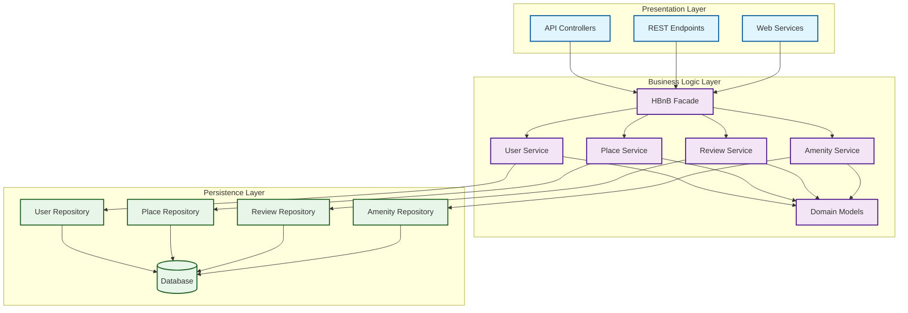

# High-Level Package Diagram (Task 0)

## Architecture en Couches / Layered Architecture



---

##  Flux global / Global flow

**FR :**  
Le client envoie une requête  API / Endpoints  
Elle passe par la **Facade** (HBnB Facade)  
La Facade délègue au bon **Service** (User, Place, Review, Amenity)  
Le Service applique les règles et appelle un **Repository**  
Le Repository communique avec la **Database**  
La réponse remonte dans le sens inverse.

**EN :**  
Client sends request  API / Endpoints  
Goes through **HBnB Facade**  
Facade delegates to the correct **Service** (User, Place, Review, Amenity)  
Service applies rules and calls a **Repository**  
Repository interacts with **Database**  
Response flows back upward.

 **Sens unique** : Presentation  Business  Persistence (jamais l'inverse)  
 **One-way** : Presentation  Business  Persistence (never the other way)

---

##  Rôle des éléments / Role of components

| Élément | FR | EN |
|---------|----|----|
| **API / Endpoints** | Reçoivent les requêtes HTTP (GET, POST…) | Receive HTTP requests |
| **HBnB Facade** | Porte d'entrée unique vers la logique métier | Single entry point to business logic |
| **Services** | Appliquent les règles métiers (validation, sécurité…) | Enforce business rules (validation, security…) |
| **Models** | Représentent les entités principales (User, Place, Review, Amenity) | Represent domain entities |
| **Repositories** | Accès structuré aux données (CRUD) | Structured access to data (CRUD) |
| **Database** | Stocke toutes les entités de manière persistante | Stores all entities persistently |

---

##  Exemple concret / Example flow

**FR :**
```
POST /users  API  Facade  UserService  UserRepo  Database  Réponse 201
```

**EN :**
```
POST /users  API  Facade  UserService  UserRepo  Database  201 Created
```

---

##  Règles importantes / Key rules

###  À éviter / Avoid
- **Aucune logique métier dans la couche Presentation**  
  *No business logic in Presentation layer*
  
- **Aucune requête SQL directe dans les Services**  
  *No raw SQL in Services*

###  Bonnes pratiques / Best practices
- **Une seule entrée : la Facade**  
  *Single entry point: the Facade*
  
- **Les dépendances descendent seulement**  
  *Dependencies go downward only*

---

##  Résumé / Summary

**FR :**  
Ce diagramme illustre la structure modulaire et hiérarchique d'HBnB. Chaque couche a une responsabilité unique, garantissant clarté, testabilité et maintenabilité.

**EN :**  
This diagram shows HBnB's layered architecture. Each layer has a single responsibility, ensuring clarity, testability, and maintainability.

---

##  Concepts clés / Key concepts

### Pattern Facade
**FR :** Le facade sert de point d'entrée unique pour simplifier l'accès à la logique métier complexe. Il réduit le couplage entre la couche de présentation et les services métier.

**EN :** The facade acts as a single entry point to simplify access to complex business logic. It reduces coupling between the presentation layer and business services.

### Séparation des responsabilités / Separation of concerns
- **Presentation** : Gestion des requêtes/réponses HTTP
- **Business Logic** : Application des règles métier
- **Persistence** : Accès et gestion des données

### Avantages / Benefits
 **Maintenabilité** : Modifications isolées par couche  
 **Testabilité** : Chaque composant testable indépendamment  
 **Évolutivité** : Ajout de fonctionnalités sans régression  
 **Clarté** : Responsabilités bien définies