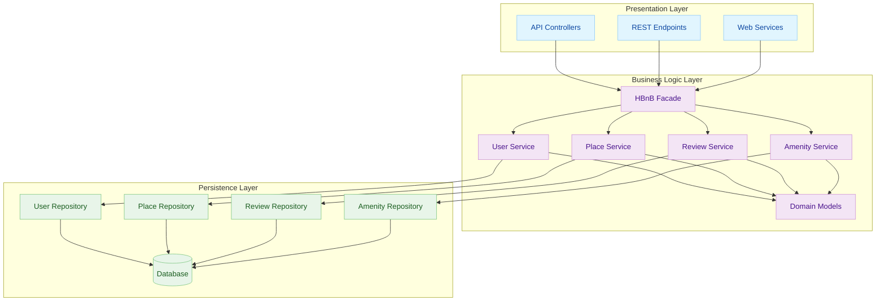

# High-Level Package Diagram (Task 0)

### 🎯 Flux global / Global flow
**FR :**  
Client → API/Endpoints → **Facade** → Service (User/Place/Review/Amenity) → Repository → Database → retour.  
Sens unique : **Presentation → Business → Persistence**.

**EN :**  
Client → API/Endpoints → **Facade** → Service (User/Place/Review/Amenity) → Repository → Database → back.  
One-way : **Presentation → Business → Persistence**.

### 🧩 Rôle des éléments / Role of components
- **API / Endpoints** — FR: reçoivent les requêtes HTTP. EN: receive HTTP requests.  
- **HBnB Facade** — FR: porte d’entrée unique métier. EN: single business entry point.  
- **Services** — FR: appliquent les règles métier. EN: enforce business rules.  
- **Models** — FR: entités du domaine (User, Place, Review, Amenity). EN: domain entities.  
- **Repositories** — FR: accès données structuré (CRUD). EN: structured data access (CRUD).  
- **Database** — FR/EN: stockage persistant.

### ✅ Règles clés / Key rules
- ❌ Pas de logique métier dans **Presentation** / No business logic in Presentation  
- ❌ Pas de SQL direct dans **Services** / No raw SQL in Services  
- ✅ Passer par la **Facade** / Use the Facade  
- ✅ Dépendances descendantes uniquement / Dependencies go downward only
