# High-Level Class Diagram (Task 1)

## Business Logic Layer - Modèle de Données

```mermaid
classDiagram
    %% ==================== DOMAIN CLASSES ====================
    class User {
        -String id
        -String firstName
        -String lastName
        -String email
        -String password
        -Boolean isAdmin
        -DateTime createdAt
        -DateTime updatedAt
        +createUser()
        +updateUser()
        +deleteUser()
        +validateEmail()
        +hashPassword()
    }
    
    class Place {
        -String id
        -String title
        -String description
        -Float price
        -Float latitude
        -Float longitude
        -DateTime createdAt
        -DateTime updatedAt
        +createPlace()
        +updatePlace()
        +deletePlace()
        +validateCoordinates()
        +calculateDistance()
    }
    
    class Review {
        -String id
        -Integer rating
        -String comment
        -DateTime createdAt
        -DateTime updatedAt
        +createReview()
        +updateReview()
        +deleteReview()
        +validateRating()
    }
    
    class Amenity {
        -String id
        -String name
        -String description
        -DateTime createdAt
        -DateTime updatedAt
        +createAmenity()
        +updateAmenity()
        +deleteAmenity()
    }
    
    %% ==================== SERVICE CLASSES ====================
    class UserService {
        +registerUser(userData)
        +loginUser(email, password)
        +getUserById(id)
        +updateUserProfile(id, data)
        +deleteUser(id)
        +getAllUsers()
    }
    
    class PlaceService {
        +createPlace(placeData, ownerId)
        +getPlaceById(id)
        +updatePlace(id, data, userId)
        +deletePlace(id, userId)
        +getPlacesByOwner(ownerId)
        +searchPlaces(criteria)
    }
    
    class ReviewService {
        +createReview(reviewData, userId, placeId)
        +getReviewById(id)
        +updateReview(id, data, userId)
        +deleteReview(id, userId)
        +getReviewsByPlace(placeId)
        +getReviewsByUser(userId)
    }
    
    class AmenityService {
        +createAmenity(amenityData)
        +getAmenityById(id)
        +updateAmenity(id, data)
        +deleteAmenity(id)
        +getAllAmenities()
    }
    
    %% ==================== RELATIONSHIPS ====================
    User "1" --> "0..*" Place : owns
    User "1" --> "0..*" Review : writes
    Place "1" --> "0..*" Review : has
    Place "0..*" --> "0..*" Amenity : includes
    
    UserService ..> User : manages
    PlaceService ..> Place : manages
    ReviewService ..> Review : manages
    AmenityService ..> Amenity : manages
    
    PlaceService ..> User : validates_owner
    ReviewService ..> User : validates_author
    ReviewService ..> Place : validates_place
```

---

##  Entités du Domaine / Domain Entities

###  User (Utilisateur)

**FR :**
- Représente un utilisateur enregistré dans le système
- `id` : Identifiant unique (UUID v4)
- `email` : Doit être unique et valide (vérifié par `validateEmail()`)
- `password` : Stocké sous forme de hash sécurisé (`hashPassword()`), **jamais en clair**
- `isAdmin` : Booléen donnant des privilèges étendus (gestion système)
- `createdAt` / `updatedAt` : Timestamps automatiques pour l'audit

**EN :**
- Represents a registered user in the system
- `id` : Unique identifier (UUID v4)
- `email` : Must be unique and valid (checked by `validateEmail()`)
- `password` : Stored as a secure hash (`hashPassword()`), **never plain text**
- `isAdmin` : Boolean indicating elevated privileges (system management)
- `createdAt` / `updatedAt` : Automatic timestamps for auditing

**Règles métier / Business rules :**
-  Email unique dans le système
-  Format email valide (RFC 5322)
-  Mot de passe hashé avec bcrypt/argon2
-  Validation côté service avant persistance

---

###  Place (Lieu)

**FR :**
- Représente un lieu publié par un utilisateur (propriété à louer)
- `id` : Identifiant unique (UUID v4)
- `title` : Titre du lieu (obligatoire, non vide)
- `description` : Description détaillée
- `price` : Prix par nuit (doit être ≥ 0)
- `latitude` : Coordonnée GPS (doit être ∈ [-90, 90])
- `longitude` : Coordonnée GPS (doit être ∈ [-180, 180])

**Méthodes importantes :**
- `validateCoordinates()` : Vérifie la validité géographique
- `calculateDistance()` : Calcule la distance entre deux lieux

**EN :**
- Represents a place listed by a user (rental property)
- `id` : Unique identifier (UUID v4)
- `title` : Place title (required, non-empty)
- `description` : Detailed description
- `price` : Price per night (must be ≥ 0)
- `latitude` : GPS coordinate (must be ∈ [-90, 90])
- `longitude` : GPS coordinate (must be ∈ [-180, 180])

**Key methods:**
- `validateCoordinates()` : Checks coordinate validity
- `calculateDistance()` : Computes geographic distance between places

**Règles métier / Business rules :**
-  Prix positif ou nul
-  Coordonnées GPS valides
-  Un utilisateur peut posséder plusieurs lieux
-  Titre obligatoire

---

###  Review (Avis)

**FR :**
- Représente un avis laissé par un utilisateur sur un lieu
- `id` : Identifiant unique (UUID v4)
- `rating` : Note comprise entre 1 et 5 (vérifié par `validateRating()`)
- `comment` : Commentaire textuel (optionnel)

**Règles métier strictes :**
-  Un utilisateur **ne peut pas** noter son propre lieu
-  Un utilisateur peut laisser **un seul avis par lieu**
-  La note doit être un entier entre 1 et 5

**EN :**
- Represents a review left by a user on a place
- `id` : Unique identifier (UUID v4)
- `rating` : Score between 1 and 5 (validated by `validateRating()`)
- `comment` : Text comment (optional)

**Strict business rules:**
-  A user **cannot** review their own place
-  A user can leave **only one review per place**
-  Rating must be an integer between 1 and 5

---

###  Amenity (Commodité)

**FR :**
- Représente un équipement ou service (ex: Wi-Fi, piscine, parking)
- `id` : Identifiant unique (UUID v4)
- `name` : Nom de l'équipement (idéalement unique et normalisé)
- `description` : Description détaillée

**Caractéristiques :**
- Relation **Many-to-Many** avec `Place` via une table d'association
- Les noms doivent être normalisés (minuscules, sans espaces superflus)

**EN :**
- Represents an amenity or service (e.g., Wi-Fi, pool, parking)
- `id` : Unique identifier (UUID v4)
- `name` : Amenity name (ideally unique and normalized)
- `description` : Detailed description

**Characteristics:**
- **Many-to-Many** relationship with `Place` via join table
- Names should be normalized (lowercase, no extra spaces)

---

##  Services (Logique Métier)

| Service | Description (FR) | Description (EN) |
|---------|------------------|------------------|
| **UserService** | Gère l'enregistrement, la connexion et la mise à jour des profils utilisateurs | Handles registration, login, and user profile updates |
| **PlaceService** | Crée, met à jour et supprime des lieux ; vérifie la propriété (`ownerId`) | Creates, updates, deletes places; verifies ownership (`ownerId`) |
| **ReviewService** | Gère la création, la mise à jour et la validation des avis ; applique les règles métier | Manages creation, update, and validation of reviews; enforces business rules |
| **AmenityService** | CRUD des équipements ; garantit l'unicité des noms | CRUD for amenities; ensures unique names |

---

##  Relations entre Entités

| Relation | Cardinalité | Description (FR) | Description (EN) |
|----------|-------------|------------------|------------------|
| **User  Place** | `1 : 0..*` | Un utilisateur possède zéro ou plusieurs lieux | One user owns zero or more places |
| **User  Review** | `1 : 0..*` | Un utilisateur écrit zéro ou plusieurs avis | One user writes zero or more reviews |
| **Place  Review** | `1 : 0..*` | Un lieu contient zéro ou plusieurs avis | One place has zero or more reviews |
| **Place  Amenity** | `0..* : 0..*` | Un lieu possède plusieurs équipements, et un équipement peut être dans plusieurs lieux | A place includes many amenities, and an amenity can be in many places |

### Relations de Service (Dépendances)

| Relation | Type | Description (FR) | Description (EN) |
|----------|------|------------------|------------------|
| `UserService  User` | Gestion | Gère le cycle de vie de l'entité User | Manages User entity lifecycle |
| `PlaceService  Place` | Gestion | Gère le cycle de vie de l'entité Place | Manages Place entity lifecycle |
| `ReviewService  Review` | Gestion | Gère le cycle de vie de l'entité Review | Manages Review entity lifecycle |
| `AmenityService  Amenity` | Gestion | Gère le cycle de vie de l'entité Amenity | Manages Amenity entity lifecycle |
| `PlaceService  User` | Validation | Valide que le propriétaire existe | Validates owner existence |
| `ReviewService  User` | Validation | Valide que l'auteur existe et n'est pas propriétaire | Validates author exists and is not owner |
| `ReviewService  Place` | Validation | Valide que le lieu existe | Validates place existence |

---

##  Conventions de Modélisation

### Attributs Communs à Toutes les Entités

**FR :**
- `id` : UUID v4 généré automatiquement à la création
- `createdAt` : Timestamp de création (immuable)
- `updatedAt` : Timestamp de dernière modification (mis à jour automatiquement)

**EN :**
- `id` : UUID v4 automatically generated on creation
- `createdAt` : Creation timestamp (immutable)
- `updatedAt` : Last modification timestamp (auto-updated)

### Symboles UML Utilisés

| Symbole | Signification (FR) | Signification (EN) |
|---------|-------------------|-------------------|
| `-` | Attribut privé | Private attribute |
| `+` | Méthode publique | Public method |
| `-->` | Association unidirectionnelle | Unidirectional association |
| `..>` | Dépendance | Dependency |
| `"1"` | Cardinalité exacte | Exact cardinality |
| `"0..*"` | Zéro ou plusieurs | Zero or more |

---

##  Règles de Validation Globales

### FR :
1. **Identifiants uniques** : Tous les objets utilisent des UUID v4
2. **Audit trail** : Dates de création et mise à jour obligatoires
3. **Email unique** : Vérifié au niveau service et base de données
4. **Pas d'auto-review** : Un utilisateur ne peut pas noter son propre lieu
5. **Un avis par lieu** : Un utilisateur ne peut laisser qu'un seul avis par lieu
6. **Coordonnées valides** : Latitude [-90, 90], Longitude [-180, 180]
7. **Prix positif** : Le prix doit être ≥ 0
8. **Rating valide** : La note doit être entre 1 et 5

### EN :
1. **Unique identifiers** : All objects use UUID v4
2. **Audit trail** : Creation and update dates mandatory
3. **Unique email** : Verified at service and database level
4. **No self-review** : A user cannot review their own place
5. **One review per place** : A user can only leave one review per place
6. **Valid coordinates** : Latitude [-90, 90], Longitude [-180, 180]
7. **Positive price** : Price must be ≥ 0
8. **Valid rating** : Rating must be between 1 and 5

---

##  Principes SOLID Appliqués

### Single Responsibility Principle (SRP)
- Chaque service gère une seule entité
- Chaque méthode a une responsabilité unique

### Open-Closed Principle (OCP)
- Services extensibles via interfaces
- Nouvelles fonctionnalités sans modifier le code existant

### Liskov Substitution Principle (LSP)
- Les implémentations de repositories sont interchangeables

### Interface Segregation Principle (ISP)
- Interfaces spécialisées par domaine

### Dependency Inversion Principle (DIP)
- Services dépendent d'abstractions (interfaces)
- Facilite les tests et l'injection de dépendances