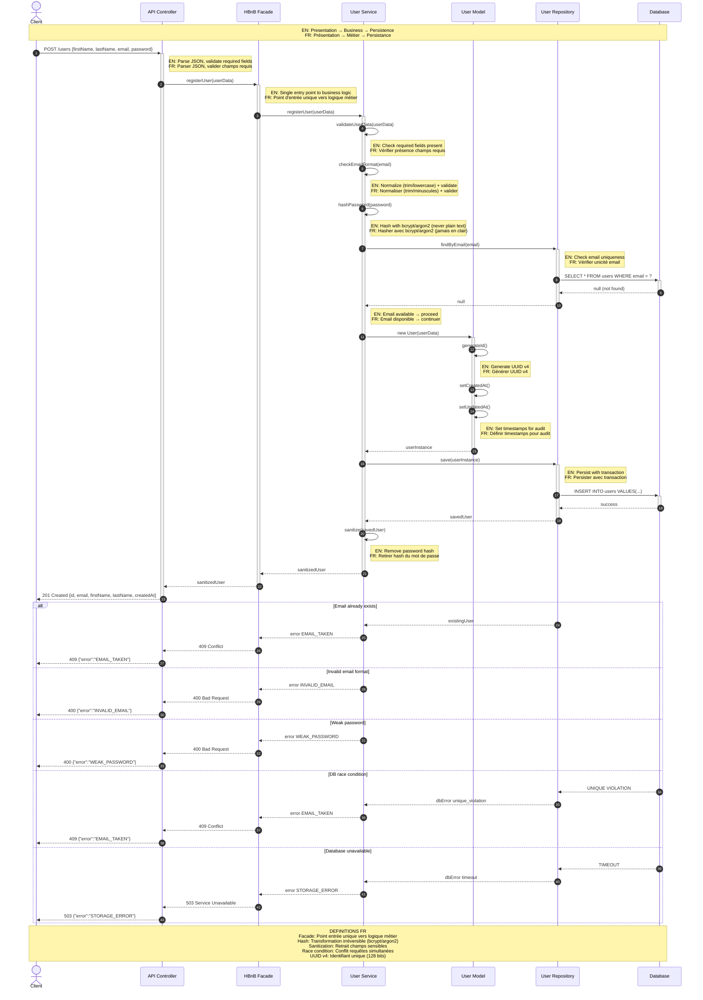
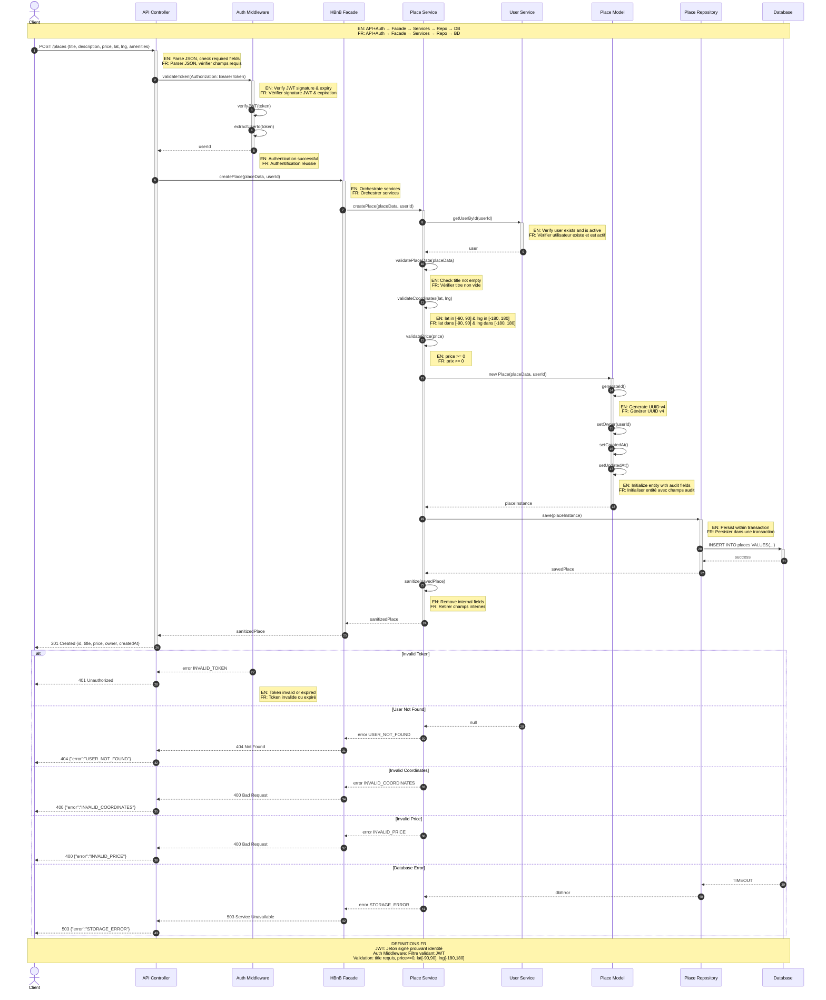
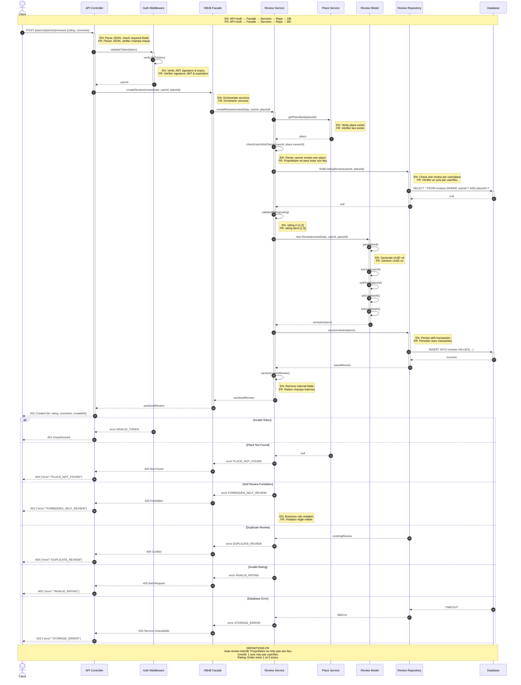
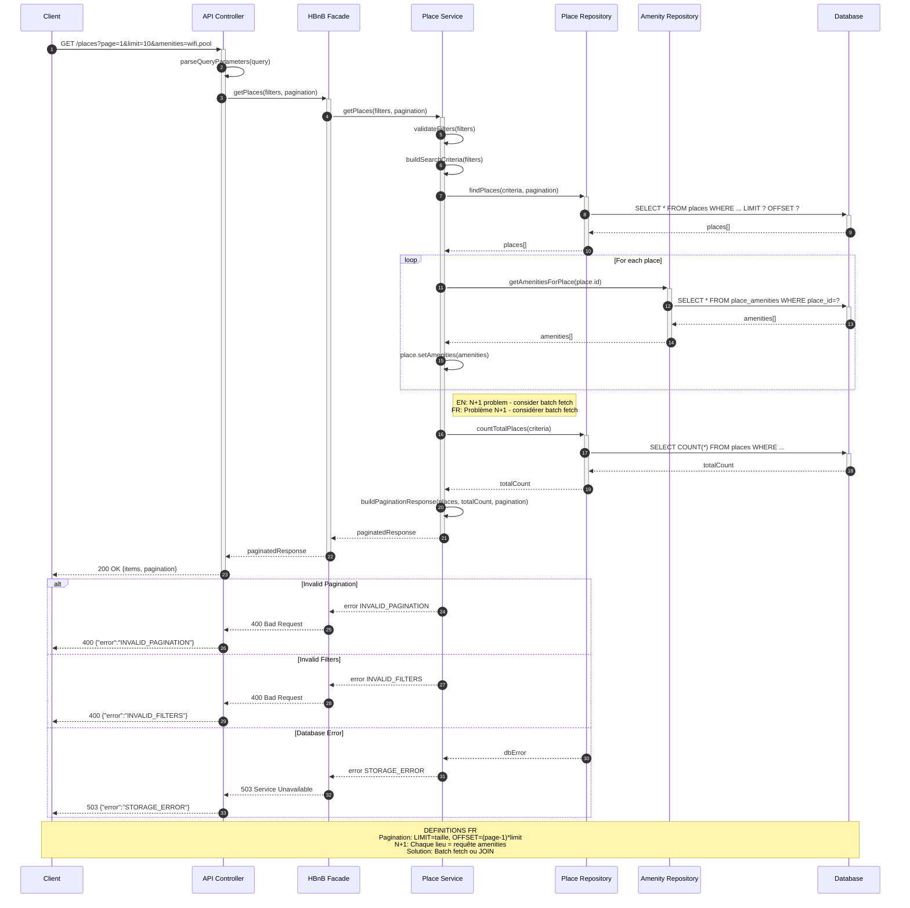

# Sequence Diagrams for API Calls (Task 2)

Ce document regroupe les 4 diagrammes de séquence principaux de l'application HBnB.

---

## 📑 Table des matières

1. [User Registration - Inscription Utilisateur](#1-user-registration)
2. [Place Creation - Création de Lieu](#2-place-creation)
3. [Review Submission - Soumission d'Avis](#3-review-submission)
4. [Fetch Places List - Récupération Liste des Lieux](#4-fetch-places-list)

---

## 1. User Registration

### Inscription d'un nouvel utilisateur



**Règles métier :**
- ✅ Email unique et valide
- ✅ Mot de passe hashé (jamais en clair)
- ✅ Timestamps automatiques (audit trail)

---

## 2. Place Creation

### Création d'un nouveau lieu par un utilisateur authentifié



**Règles métier :**
- ✅ Authentification JWT obligatoire
- ✅ Coordonnées GPS valides
- ✅ Prix positif ou nul
- ✅ Titre obligatoire

---

## 3. Review Submission

### Soumission d'un avis par un utilisateur sur un lieu



**Règles métier :**
- ❌ Pas d'auto-évaluation (propriétaire)
- ✅ Un seul avis par utilisateur/lieu
- ✅ Rating entre 1 et 5
- ✅ Authentification requise

---

## 4. Fetch Places List

### Récupération de la liste des lieux avec filtres et pagination



**Fonctionnalités :**
- ✅ Pagination (page, limit)
- ✅ Filtres (prix, géolocalisation, amenities)
- ✅ Comptage total pour métadonnées
- ⚠️ Problème N+1 identifié (optimisation possible)

---

## 📊 Résumé des Codes HTTP

| Code | Signification | Utilisation |
|------|---------------|-------------|
| **200** | OK | Requête GET réussie |
| **201** | Created | Ressource créée avec succès (POST) |
| **400** | Bad Request | Données invalides (format, validation) |
| **401** | Unauthorized | Authentification manquante ou invalide |
| **403** | Forbidden | Action interdite (ex: auto-review) |
| **404** | Not Found | Ressource inexistante |
| **409** | Conflict | Conflit (ex: email déjà utilisé, avis dupliqué) |
| **503** | Service Unavailable | Service temporairement indisponible (DB down) |

---

## 🔑 Glossaire Technique

| Terme | Définition FR | Definition EN |
|-------|---------------|---------------|
| **Facade** | Point d'entrée unique qui simplifie l'accès à la logique métier | Single entry point simplifying access to business logic |
| **JWT** | JSON Web Token - jeton signé prouvant l'identité de l'utilisateur | Signed token proving user identity |
| **Hash** | Transformation irréversible d'un mot de passe (bcrypt/argon2) | Irreversible password transformation |
| **Sanitization** | Retrait des champs sensibles avant la réponse | Removal of sensitive fields before response |
| **Race Condition** | Conflit causé par deux requêtes simultanées | Conflict caused by concurrent requests |
| **UUID v4** | Identifiant unique universel (128 bits) | Universal unique identifier |
| **N+1 Problem** | Problème de performance : 1 requête + N requêtes par élément | Performance issue: 1 query + N queries per item |
| **Pagination** | Division des résultats en pages (LIMIT/OFFSET) | Result division into pages |
| **Transaction** | Opération atomique (tout réussit ou tout échoue) | Atomic operation (all or nothing) |

---

## 🎯 Flux Général de l'Application

```
┌─────────┐
│ Client  │
└────┬────┘
     │ HTTP Request (POST, GET, etc.)
     ▼
┌────────────────┐
│ API Controller │ ← Parse JSON, validate basic format
└────┬───────────┘
     │
     ▼
┌────────────────┐
│ Auth Middleware│ ← Validate JWT (if required)
└────┬───────────┘
     │
     ▼
┌────────────────┐
│  HBnB Facade   │ ← Single entry point, orchestration
└────┬───────────┘
     │
     ▼
┌────────────────┐
│    Service     │ ← Apply business rules, validations
└────┬───────────┘
     │
     ▼
┌────────────────┐
│     Model      │ ← Domain entity (User, Place, Review)
└────┬───────────┘
     │
     ▼
┌────────────────┐
│   Repository   │ ← Data access abstraction
└────┬───────────┘
     │
     ▼
┌────────────────┐
│    Database    │ ← Persistent storage
└────────────────┘
     │
     └─── Response flows back upward ───┐
                                        │
                                        ▼
                                   ┌─────────┐
                                   │ Client  │
                                   └─────────┘
```

---

## ✅ Principes Architecturaux Appliqués

### Séparation des Responsabilités
- **Présentation** : Gestion HTTP, parsing, validation basique
- **Logique Métier** : Règles business, orchestration
- **Persistance** : Accès données, transactions

### Pattern Facade
- Point d'entrée unique vers la logique métier
- Simplifie les interactions entre couches
- Standardise la gestion des erreurs

### Validation Multi-Niveaux
1. **API** : Format JSON, champs requis
2. **Service** : Règles métier (email unique, prix positif, etc.)
3. **Database** : Contraintes d'intégrité (UNIQUE, NOT NULL, etc.)

### Sécurité
- Authentification JWT pour opérations sensibles
- Mots de passe hashés (jamais en clair)
- Sanitization des réponses (pas de données sensibles)
- Validation stricte des entrées utilisateur