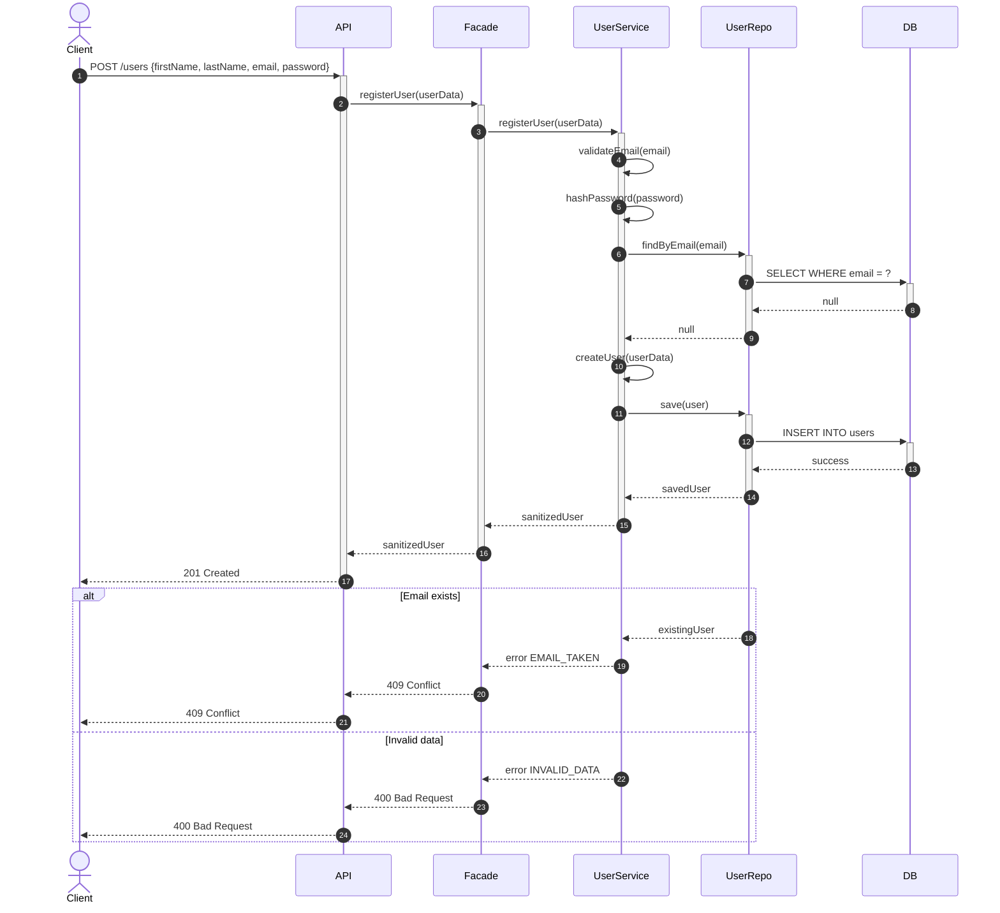
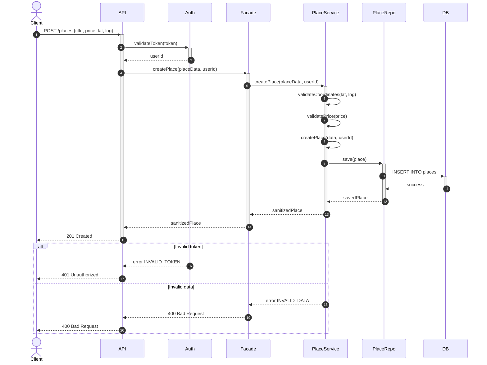
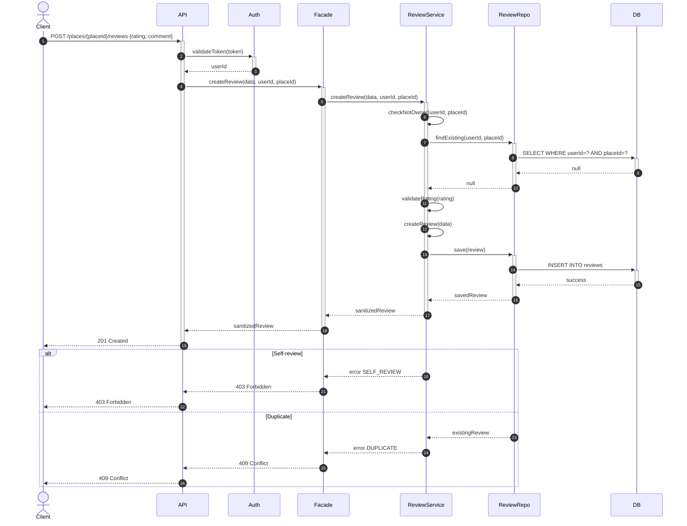
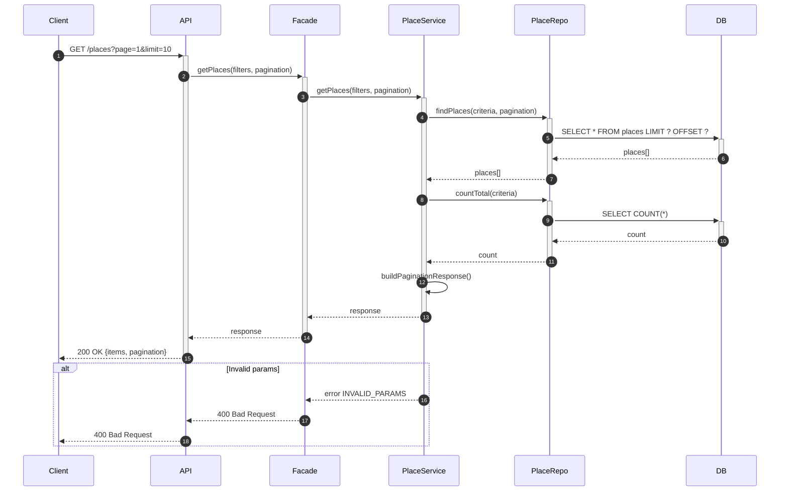

# Sequence Diagrams for API Calls (Task 2)

Ce document regroupe les 4 diagrammes de séquence principaux de l'application HBnB.

---

## 📑 Table des matières

1. [User Registration - Inscription Utilisateur](#1-user-registration)
2. [Place Creation - Création de Lieu](#2-place-creation)
3. [Review Submission - Soumission d'Avis](#3-review-submission)
4. [Fetch Places List - Récupération Liste des Lieux](#4-fetch-places-list)

---

## 1. User Registration

### Inscription d'un nouvel utilisateur



**Règles :** Email unique, mot de passe hashé, validation des données

---

## 2. Place Creation

### Création d'un nouveau lieu



**Règles :** JWT requis, coordonnées valides, prix ≥ 0

---

## 3. Review Submission

### Soumission d'un avis



**Règles :** Pas d'auto-review, 1 avis par lieu, rating 1-5

---

## 4. Fetch Places List

### Récupération liste des lieux



**Fonctionnalités :** Pagination, filtres, comptage total

---

## 📊 Codes HTTP

| Code | Usage |
|------|-------|
| 200 | GET réussi |
| 201 | POST réussi (ressource créée) |
| 400 | Données invalides |
| 401 | Non authentifié |
| 403 | Action interdite |
| 404 | Ressource inexistante |
| 409 | Conflit (email/avis dupliqué) |
| 503 | Service indisponible |

---

## 🔑 Concepts Clés

**Facade** : Point d'entrée unique vers la logique métier

**JWT** : Token d'authentification signé

**Validation** : Email unique, prix ≥ 0, rating 1-5, coordonnées GPS valides

**Règles métier** : 
- Pas d'auto-évaluation
- Un avis par utilisateur/lieu
- Mot de passe hashé (jamais en clair)

---

## 🎯 Flux Général

```
Client → API → Auth (si requis) → Facade → Service → Repository → Database
```