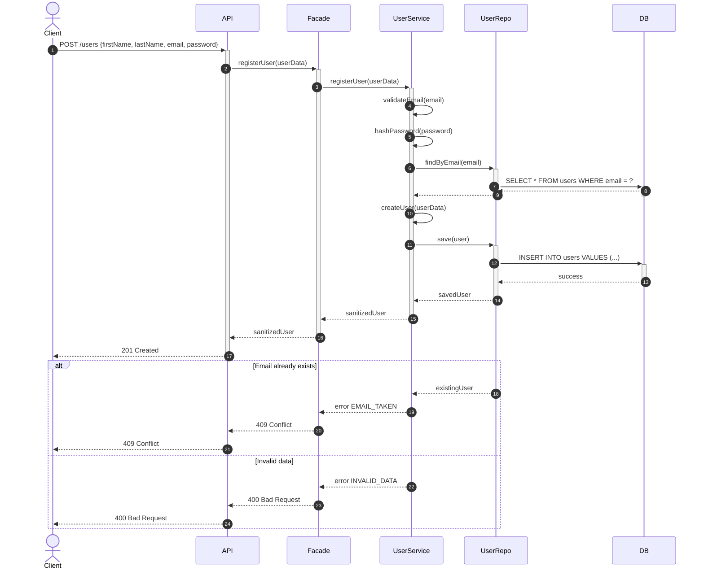

# Sequence Diagrams for API Calls (Task 2)

##  Table des matières / Table of Contents

1. [User Registration – Inscription utilisateur](#1-user-registration)
2. [Place Creation – Création de lieu](#2-place-creation)
3. [Review Submission – Soumission d'avis](#3-review-submission)
4. [Fetch Places List – Récupération de la liste des lieux](#4-fetch-places-list)

---

## 1⃣ User Registration – Inscription utilisateur



 **FR :** Vérifie l'unicité de l'email, hache le mot de passe avant stockage.  
 **EN :** Checks unique email, hashes password before saving.

---

## 2⃣ Place Creation – Création de lieu


 **FR :** JWT requis, coordonnées valides, prix ≥ 0.  
 **EN :** JWT required, valid coordinates, price ≥ 0.

---

## 3⃣ Review Submission – Soumission d'avis


 **FR :** Un utilisateur ne peut pas noter son propre lieu, un seul avis par lieu.  
 **EN :** User cannot review their own place, one review per place only.

---

## 4⃣ Fetch Places List – Récupération de la liste des lieux


 **FR :** Supporte la pagination, les filtres et le comptage total.  
 **EN :** Supports pagination, filters, and total count.

---

##  HTTP Codes – Codes de réponse

| Code | Signification (FR) | Meaning (EN) |
|------|-------------------|--------------|
| **200** | Requête GET réussie | Successful GET |
| **201** | Création réussie | Resource created |
| **400** | Données invalides | Invalid data |
| **401** | Non authentifié | Unauthorized |
| **403** | Action interdite | Forbidden |
| **404** | Ressource introuvable | Not found |
| **409** | Conflit (ex: email, review doublon) | Conflict (duplicate email/review) |
| **503** | Service temporairement indisponible | Service unavailable |

---

##  Concepts clés / Key Concepts

| Concept | FR | EN |
|---------|----|----|
| **Facade** | Point d'entrée unique vers la logique métier | Single entry point to business logic |
| **JWT** | Jeton d'authentification signé pour la sécurité | Signed authentication token |
| **Validation** | Email unique, prix ≥ 0, note 1–5, coordonnées valides | Unique email, price ≥ 0, rating 1–5, valid coordinates |
| **Règles métier / Business rules** | Pas d'auto-review, 1 avis par (utilisateur, lieu), mot de passe hashé | No self-review, 1 review per (user, place), password hashed |

---

##  Flux général / Global flow

```
Client  API  Auth (si requis)  Facade  Service  Repository  Database  (retour)
```

**FR :** Requête descend dans les couches, réponse remonte dans l'ordre inverse.  
**EN :** Request flows downward through layers, response flows back upward.