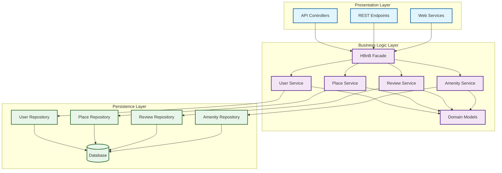
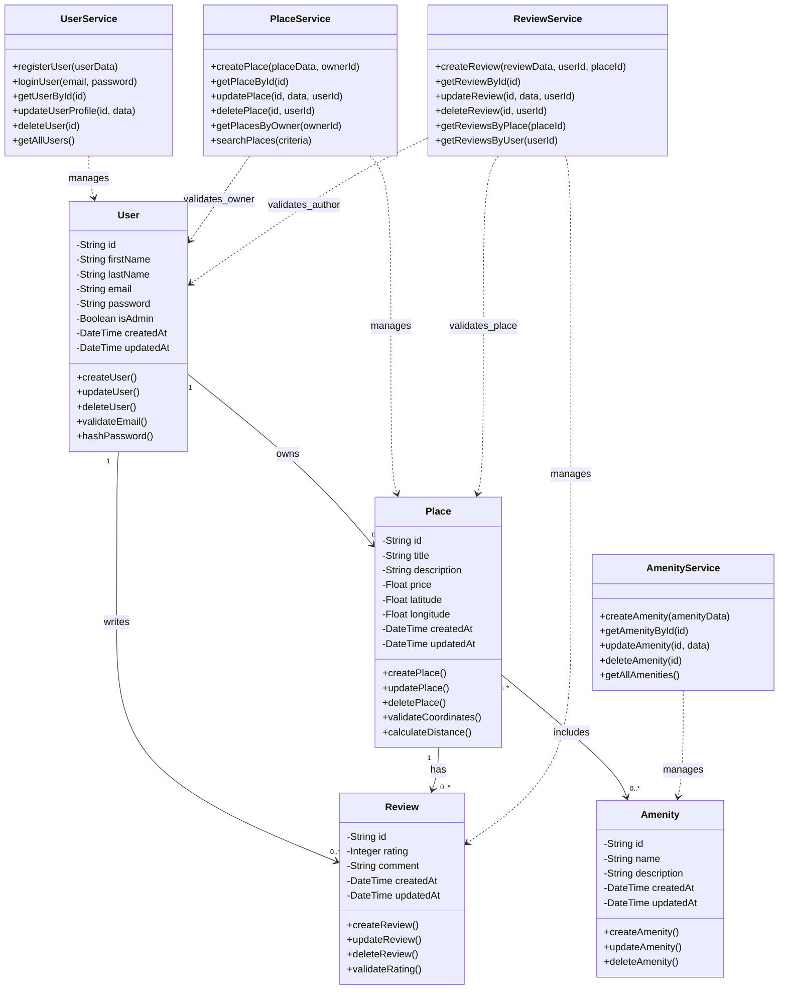
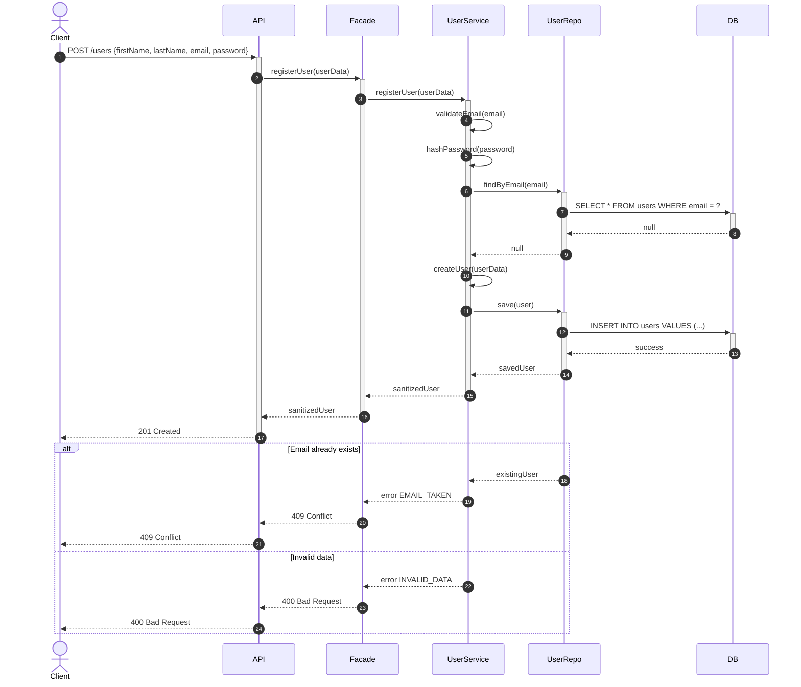
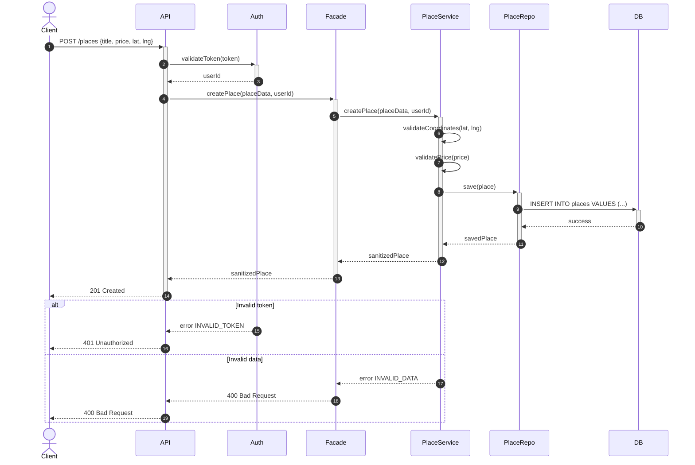
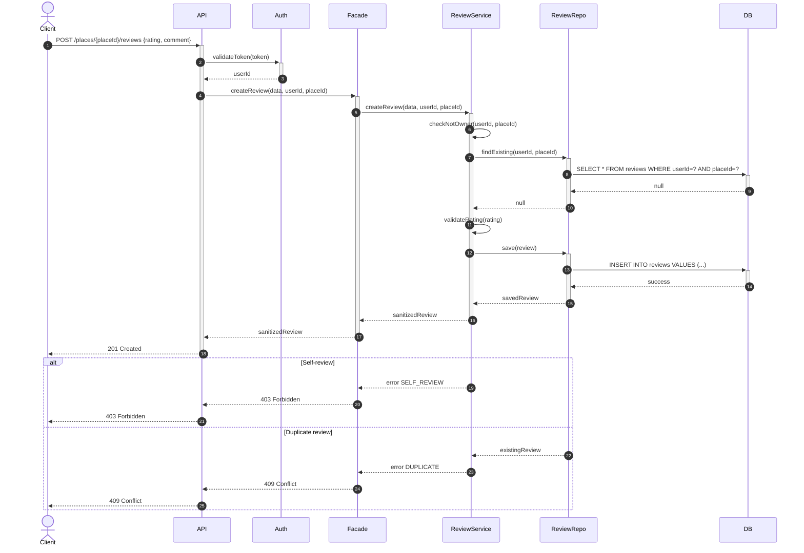
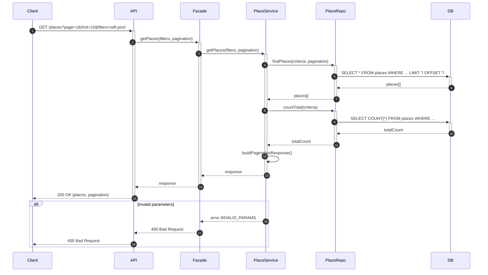

# HBnB Evolution - Complete Technical Documentation / Documentation Technique Complète

##  Project Information / Informations du Projet

**Project / Projet :** HBnB Evolution - Part 1 (UML Design)  
**Team / Équipe :** Yassin Jaghmim, Guillaume Watelet  
**Date :** October / Octobre 2025  
**Version :** 1.0  

---

##  Table of Contents / Table des matières

1. [Introduction](#introduction)
2. [General Architecture (Task 0) / Architecture Générale](#task-0-general-architecture--architecture-générale)
3. [Class Model (Task 1) / Modèle de Classes](#task-1-class-model--modèle-de-classes)
4. [Sequence Diagrams (Task 2) / Diagrammes de Séquence](#task-2-sequence-diagrams--diagrammes-de-séquence)
5. [Business Rules and Validation / Règles Métier et Validation](#business-rules-and-validation--règles-métier-et-validation)
6. [Conclusion](#conclusion)

---

## Introduction

###  Project Objective / Objectif du Projet

**EN:** HBnB Evolution is a simplified AirBnB-like application. This first part (Part 1) focuses on the **design and technical documentation** of the system architecture, without code implementation.

**FR:** HBnB Evolution est une application de type AirBnB simplifiée. Cette première partie (Part 1) se concentre sur la **conception et la documentation technique** de l'architecture du système, sans implémentation de code.

###  Deliverables / Livrables

**EN:** This documentation includes:
- **Package diagram** (layered architecture)
- **Class diagram** (entities and services)
- **4 sequence diagrams** (API flows)
- **Business rules and constraints**

**FR:** Cette documentation regroupe :
- **Diagramme de packages** (architecture en couches)
- **Diagramme de classes** (entités et services)
- **4 diagrammes de séquence** (flux API)
- **Règles métier et contraintes**

###  Architecture / Architecture Choisie

**Architectural Pattern / Pattern Architectural :** Layered Architecture / Architecture en couches  
**Design Pattern / Pattern de Conception :** Facade for inter-layer communication / Facade pour la communication entre couches

---

## Task 0: General Architecture / Architecture Générale

### Package Diagram - Overview / Diagramme de Packages - Vue d'ensemble



###  Communication Flow / Flux de Communication

```
Client  API  Facade  Service  Repository  Database  (back)
Client  API  Facade  Service  Repository  Database  (retour)
```

**EN:** Request flows downward through layers, response flows back upward.  
**FR:** Requête descend dans les couches, réponse remonte dans l'ordre inverse.

###  Layer Responsibilities / Rôle des Couches

| Layer / Couche | Responsibility (EN) | Responsabilité (FR) |
|----------------|---------------------|---------------------|
| **Presentation** | Handles HTTP requests, JSON parsing, basic validation | Gestion des requêtes HTTP, parsing JSON, validation basique |
| **Business Logic** | Enforces business rules, orchestration, validation | Application des règles métier, orchestration, validation |
| **Persistence** | Data access, transactions, database communication | Accès aux données, transactions, communication base de données |

###  Facade Pattern

**EN:** The Facade acts as a **single entry point** to business logic. It simplifies interactions between presentation and business services, reduces coupling, and standardizes error handling.

**FR:** Le Facade sert de **point d'entrée unique** vers la logique métier. Il simplifie les interactions entre la couche de présentation et les services métier, réduit le couplage et standardise la gestion des erreurs.

**Benefits / Avantages :**
-  Reduces coupling between layers / Réduit le couplage entre couches
-  Centralizes orchestration / Centralise l'orchestration
-  Facilitates unit testing / Facilite les tests unitaires
-  Standardizes error handling / Standardise la gestion des erreurs

---

## Task 1: Class Model / Modèle de Classes

### Complete Class Diagram / Diagramme de Classes Complet



###  Domain Entities / Entités du Domaine

####  User / Utilisateur

**EN:**
- Represents a registered user in the system
- `id`: Unique identifier (UUID v4)
- `email`: Must be unique and valid
- `password`: Stored as hash (never plain text)
- `isAdmin`: Boolean for elevated privileges
- `createdAt/updatedAt`: Automatic timestamps for auditing

**FR:**
- Représente un utilisateur enregistré dans le système
- `id`: Identifiant unique (UUID v4)
- `email`: Doit être unique et valide
- `password`: Stocké sous forme de hash (jamais en clair)
- `isAdmin`: Booléen pour privilèges élevés
- `createdAt/updatedAt`: Timestamps automatiques pour l'audit

####  Place / Lieu

**EN:**
- Represents a place listed by a user
- `price`: Must be ≥ 0
- `latitude`: Must be in [-90, 90]
- `longitude`: Must be in [-180, 180]
- Methods validate coordinates and calculate distances

**FR:**
- Représente un lieu publié par un utilisateur
- `price`: Doit être ≥ 0
- `latitude`: Doit être dans [-90, 90]
- `longitude`: Doit être dans [-180, 180]
- Méthodes pour valider coordonnées et calculer distances

####  Review / Avis

**EN:**
- Represents a review left by a user on a place
- `rating`: Integer between 1 and 5
- **Business rules:**
  - User cannot review their own place
  - One review per user per place

**FR:**
- Représente un avis laissé par un utilisateur sur un lieu
- `rating`: Entier entre 1 et 5
- **Règles métier:**
  - Utilisateur ne peut pas noter son propre lieu
  - Un avis par utilisateur par lieu

####  Amenity / Commodité

**EN:**
- Represents an amenity or service (WiFi, pool, parking)
- Many-to-many relationship with Place
- Names should be unique and normalized

**FR:**
- Représente une commodité ou service (WiFi, piscine, parking)
- Relation plusieurs-à-plusieurs avec Place
- Noms doivent être uniques et normalisés

###  Relationships / Relations

| Relation | Cardinality / Cardinalité | Description (EN) | Description (FR) |
|----------|---------------------------|------------------|------------------|
| **User  Place** | `1 : 0..*` | One user owns zero or more places | Un utilisateur possède zéro ou plusieurs lieux |
| **User  Review** | `1 : 0..*` | One user writes zero or more reviews | Un utilisateur écrit zéro ou plusieurs avis |
| **Place  Review** | `1 : 0..*` | One place has zero or more reviews | Un lieu contient zéro ou plusieurs avis |
| **Place  Amenity** | `0..* : 0..*` | Many-to-many relationship | Relation plusieurs-à-plusieurs |

---

## Task 2: Sequence Diagrams / Diagrammes de Séquence

### 1⃣ User Registration / Inscription utilisateur



 **EN:** Checks unique email, hashes password before saving.  
 **FR:** Vérifie l'unicité de l'email, hache le mot de passe avant stockage.

---

### 2⃣ Place Creation / Création de lieu



 **EN:** JWT required, valid coordinates, price ≥ 0.  
 **FR:** JWT requis, coordonnées valides, prix ≥ 0.

---

### 3⃣ Review Submission / Soumission d'avis



 **EN:** User cannot review their own place, one review per place only.  
 **FR:** Un utilisateur ne peut pas noter son propre lieu, un seul avis par lieu.

---

### 4⃣ Fetch Places List / Récupération de la liste des lieux



 **EN:** Supports pagination, filters, and total count.  
 **FR:** Supporte la pagination, les filtres et le comptage total.

---

## Business Rules and Validation / Règles Métier et Validation

###  Global Validation Rules / Règles de Validation Globales

| Rule / Règle | EN | FR |
|--------------|----|----|
| **Unique IDs** | All objects use UUID v4 | Tous les objets utilisent UUID v4 |
| **Audit trail** | createdAt and updatedAt mandatory | createdAt et updatedAt obligatoires |
| **Unique email** | Verified at service and database level | Vérifié au niveau service et base de données |
| **No self-review** | User cannot review their own place | Utilisateur ne peut pas noter son propre lieu |
| **One review per place** | One review per user per place | Un avis par utilisateur par lieu |
| **Valid coordinates** | lat ∈ [-90, 90], lng ∈ [-180, 180] | lat ∈ [-90, 90], lng ∈ [-180, 180] |
| **Positive price** | price ≥ 0 | prix ≥ 0 |
| **Valid rating** | rating ∈ [1, 5] | rating ∈ [1, 5] |
| **Password security** | Hashed with bcrypt/argon2 (never plain text) | Hashé avec bcrypt/argon2 (jamais en clair) |

###  HTTP Status Codes / Codes de Statut HTTP

| Code | Meaning (EN) | Signification (FR) |
|------|--------------|-------------------|
| **200** | Successful GET | Requête GET réussie |
| **201** | Resource created | Ressource créée |
| **400** | Invalid data | Données invalides |
| **401** | Unauthorized | Non authentifié |
| **403** | Forbidden | Action interdite |
| **404** | Not found | Ressource introuvable |
| **409** | Conflict (duplicate email/review) | Conflit (email/avis dupliqué) |
| **503** | Service unavailable | Service indisponible |

###  Key Technical Concepts / Concepts Techniques Clés

| Concept | EN | FR |
|---------|----|----|
| **Facade** | Single entry point to business logic | Point d'entrée unique vers la logique métier |
| **JWT** | Signed authentication token | Jeton d'authentification signé |
| **Validation** | Unique email, price ≥ 0, rating 1-5, valid coordinates | Email unique, prix ≥ 0, note 1-5, coordonnées valides |
| **Business rules** | No self-review, 1 review per (user, place), password hashed | Pas d'auto-review, 1 avis par (utilisateur, lieu), mot de passe hashé |
| **Repository** | Data access abstraction layer | Couche d'abstraction d'accès aux données |
| **Service** | Business logic implementation | Implémentation de la logique métier |

---

## Conclusion

###  Summary / Résumé

**EN:**  
This document presents the complete UML design for HBnB Evolution Part 1. The layered architecture with Facade pattern ensures:
- Clear separation of concerns
- Easy testability and maintainability
- Scalability for future features
- Standardized error handling

The design follows SOLID principles and industry best practices, providing a solid foundation for implementation in Part 2.

**FR:**  
Ce document présente la conception UML complète pour HBnB Evolution Part 1. L'architecture en couches avec pattern Facade garantit :
- Séparation claire des responsabilités
- Testabilité et maintenabilité facilitées
- Évolutivité pour les fonctionnalités futures
- Gestion standardisée des erreurs

La conception suit les principes SOLID et les meilleures pratiques de l'industrie, fournissant une base solide pour l'implémentation dans la Part 2.

###  Next Steps / Prochaines Étapes

1. **Part 2:** REST API implementation / Implémentation de l'API REST
2. **Part 3:** Database integration / Intégration de la base de données
3. **Part 4:** Frontend interface / Interface utilisateur frontend

###  Team / Équipe

- **Yassin Jaghmim**
- **Guillaume Watelet**

**Date:** October 2025 / Octobre 2025  
**Version:** 1.0  
**Status:** Ready for review / Prêt pour revue
