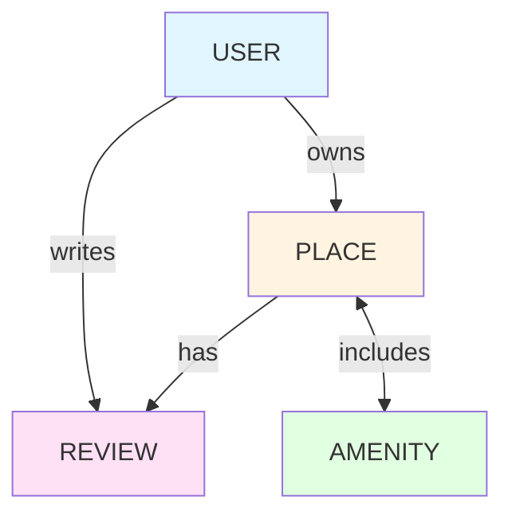

# HBnB Database Schema - ER Diagram

## Entity-Relationship Diagram (Mermaid.js)

```mermaid
erDiagram
    USER ||--o{ PLACE : owns
    USER ||--o{ REVIEW : writes
    PLACE ||--o{ REVIEW : has
    PLACE }o--o{ AMENITY : includes

    USER {
        int id PK
        string first_name
        string last_name
        string email UK
        string password
        boolean is_admin
        datetime created_at
        datetime updated_at
    }

    PLACE {
        int id PK
        string title
        string description
        float price
        float latitude
        float longitude
        int owner_id FK
        datetime created_at
        datetime updated_at
    }

    REVIEW {
        int id PK
        string text
        int rating
        int place_id FK
        int user_id FK
        datetime created_at
        datetime updated_at
        unique(user_id, place_id) UK
    }

    AMENITY {
        int id PK
        string name
        datetime created_at
        datetime updated_at
    }

    PLACE_AMENITY {
        int place_id FK
        int amenity_id FK
    }
```

## Légende / Legend

### Types de Relations / Relationship Types
- `||--o{` : One-to-Many (Un-à-Plusieurs)
- `}o--o{` : Many-to-Many (Plusieurs-à-Plusieurs)

### Annotations
- `PK` : Primary Key (Clé Primaire)
- `FK` : Foreign Key (Clé Étrangère)
- `UK` : Unique Key (Clé Unique)

## Description des Relations / Relationship Descriptions

### FR 🇫🇷

1. **USER → PLACE** (Un-à-Plusieurs)
   - Un utilisateur peut posséder plusieurs places
   - Une place appartient à un seul utilisateur (propriétaire)

2. **USER → REVIEW** (Un-à-Plusieurs)
   - Un utilisateur peut écrire plusieurs avis
   - Un avis est écrit par un seul utilisateur

3. **PLACE → REVIEW** (Un-à-Plusieurs)
   - Une place peut avoir plusieurs avis
   - Un avis concerne une seule place

4. **PLACE ↔ AMENITY** (Plusieurs-à-Plusieurs)
   - Une place peut avoir plusieurs équipements
   - Un équipement peut être présent dans plusieurs places
   - Relation gérée par la table d'association `PLACE_AMENITY`

### EN 🇬🇧

1. **USER → PLACE** (One-to-Many)
   - A user can own multiple places
   - A place belongs to one user (owner)

2. **USER → REVIEW** (One-to-Many)
   - A user can write multiple reviews
   - A review is written by one user

3. **PLACE → REVIEW** (One-to-Many)
   - A place can have multiple reviews
   - A review is about one place

4. **PLACE ↔ AMENITY** (Many-to-Many)
   - A place can have multiple amenities
   - An amenity can be in multiple places
   - Relationship managed by the `PLACE_AMENITY` association table

## Contraintes de Base de Données / Database Constraints

### FR 🇫🇷

- **Clés primaires** : Chaque table a un `id` auto-incrémenté
- **Clés étrangères** : 
  - `PLACE.owner_id` → `USER.id`
  - `REVIEW.place_id` → `PLACE.id`
  - `REVIEW.user_id` → `USER.id`
  - `PLACE_AMENITY.place_id` → `PLACE.id`
  - `PLACE_AMENITY.amenity_id` → `AMENITY.id`
- **Contraintes d'unicité** : `USER.email` doit être unique
- **Contraintes NOT NULL** : Tous les champs sauf `PLACE.description` sont obligatoires
- **Timestamps** : Toutes les tables ont `created_at` et `updated_at`

### EN 🇬🇧

- **Primary keys**: Each table has an auto-incremented `id`
- **Foreign keys**:
  - `PLACE.owner_id` → `USER.id`
  - `REVIEW.place_id` → `PLACE.id`
  - `REVIEW.user_id` → `USER.id`
  - `PLACE_AMENITY.place_id` → `PLACE.id`
  - `PLACE_AMENITY.amenity_id` → `AMENITY.id`
- **Unique constraints**: `USER.email` must be unique
- **NOT NULL constraints**: All fields except `PLACE.description` are required
- **Timestamps**: All tables have `created_at` and `updated_at`

## Règles Métier / Business Rules

### FR 🇫🇷

1. **Authentification** : Les mots de passe sont hachés avec bcrypt
2. **Autorisation** : Les utilisateurs avec `is_admin = true` ont des privilèges spéciaux
3. **Validation des avis** :
   - Un utilisateur ne peut pas évaluer sa propre place
   - Un utilisateur ne peut évaluer une place qu'une seule fois
   - Les notes doivent être entre 1 et 5
4. **Validation des places** :
   - La latitude doit être entre -90 et 90
   - La longitude doit être entre -180 et 180
   - Le prix doit être positif

### EN 🇬🇧

1. **Authentication**: Passwords are hashed with bcrypt
2. **Authorization**: Users with `is_admin = true` have special privileges
3. **Review validation**:
   - A user cannot review their own place
   - A user can only review a place once
   - Ratings must be between 1 and 5
4. **Place validation**:
   - Latitude must be between -90 and 90
   - Longitude must be between -180 and 180
   - Price must be positive

## Visualisation Alternative / Alternative Visualization

### Diagramme Simplifié / Simplified Diagram



