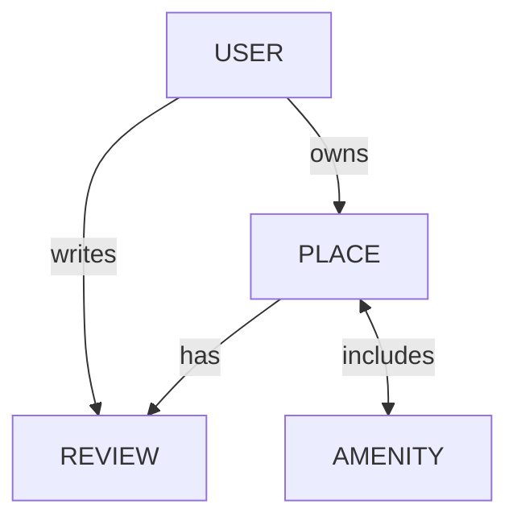

 HBnB Database Schema - ER Diagram

 Entity-Relationship Diagram (Mermaid.js)

```mermaid
erDiagram
    USER ||--o{ PLACE : owns
    USER ||--o{ REVIEW : writes
    PLACE ||--o{ REVIEW : has
    PLACE }o--o{ AMENITY : includes

    USER {
        int id PK
        string first_name
        string last_name
        string email UK
        string password
        boolean is_admin
        datetime created_at
        datetime updated_at
    }

    PLACE {
        int id PK
        string title
        string description
        float price
        float latitude
        float longitude
        int owner_id FK
        datetime created_at
        datetime updated_at
    }

    REVIEW {
        int id PK
        string text
        int rating
        int place_id FK
        int user_id FK
        datetime created_at
        datetime updated_at
        unique(user_id, place_id) UK
    }

    AMENITY {
        int id PK
        string name
        datetime created_at
        datetime updated_at
    }

    PLACE_AMENITY {
        int place_id FK
        int amenity_id FK
    }
```

 Lgende / Legend

 Types de Relations / Relationship Types
- `||--o{` : One-to-Many (Un-à-Plusieurs)
- `}o--o{` : Many-to-Many (Plusieurs-à-Plusieurs)

 Annotations
- `PK` : Primary Key (Cl Primaire)
- `FK` : Foreign Key (Cl Étrangère)
- `UK` : Unique Key (Cl Unique)

 Description des Relations / Relationship Descriptions

 FR 

. USER  PLACE (Un-à-Plusieurs)
   - Un utilisateur peut possder plusieurs places
   - Une place appartient à un seul utilisateur (propritaire)

. USER  REVIEW (Un-à-Plusieurs)
   - Un utilisateur peut crire plusieurs avis
   - Un avis est crit par un seul utilisateur

. PLACE  REVIEW (Un-à-Plusieurs)
   - Une place peut avoir plusieurs avis
   - Un avis concerne une seule place

. PLACE  AMENITY (Plusieurs-à-Plusieurs)
   - Une place peut avoir plusieurs quipements
   - Un quipement peut être prsent dans plusieurs places
   - Relation gre par la table d'association `PLACE_AMENITY`

 EN 

. USER  PLACE (One-to-Many)
   - A user can own multiple places
   - A place belongs to one user (owner)

. USER  REVIEW (One-to-Many)
   - A user can write multiple reviews
   - A review is written by one user

. PLACE  REVIEW (One-to-Many)
   - A place can have multiple reviews
   - A review is about one place

. PLACE  AMENITY (Many-to-Many)
   - A place can have multiple amenities
   - An amenity can be in multiple places
   - Relationship managed by the `PLACE_AMENITY` association table

 Contraintes de Base de Donnes / Database Constraints

 FR 

- Cls primaires : Chaque table a un `id` auto-incrment
- Cls trangères : 
  - `PLACE.owner_id`  `USER.id`
  - `REVIEW.place_id`  `PLACE.id`
  - `REVIEW.user_id`  `USER.id`
  - `PLACE_AMENITY.place_id`  `PLACE.id`
  - `PLACE_AMENITY.amenity_id`  `AMENITY.id`
- Contraintes d'unicit : `USER.email` doit être unique
- Contraintes NOT NULL : Tous les champs sauf `PLACE.description` sont obligatoires
- Timestamps : Toutes les tables ont `created_at` et `updated_at`

 EN 

- Primary keys: Each table has an auto-incremented `id`
- Foreign keys:
  - `PLACE.owner_id`  `USER.id`
  - `REVIEW.place_id`  `PLACE.id`
  - `REVIEW.user_id`  `USER.id`
  - `PLACE_AMENITY.place_id`  `PLACE.id`
  - `PLACE_AMENITY.amenity_id`  `AMENITY.id`
- Unique constraints: `USER.email` must be unique
- NOT NULL constraints: All fields except `PLACE.description` are required
- Timestamps: All tables have `created_at` and `updated_at`

 Règles Mtier / Business Rules

 FR 

. Authentification : Les mots de passe sont hachs avec bcrypt
. Autorisation : Les utilisateurs avec `is_admin = true` ont des privilèges spciaux
. Validation des avis :
   - Un utilisateur ne peut pas valuer sa propre place
   - Un utilisateur ne peut valuer une place qu'une seule fois
   - Les notes doivent être entre  et 
. Validation des places :
   - La latitude doit être entre - et 
   - La longitude doit être entre - et 
   - Le prix doit être positif

 EN 

. Authentication: Passwords are hashed with bcrypt
. Authorization: Users with `is_admin = true` have special privileges
. Review validation:
   - A user cannot review their own place
   - A user can only review a place once
   - Ratings must be between  and 
. Place validation:
   - Latitude must be between - and 
   - Longitude must be between - and 
   - Price must be positive

 Visualisation Alternative / Alternative Visualization

 Diagramme Simplifi / Simplified Diagram



