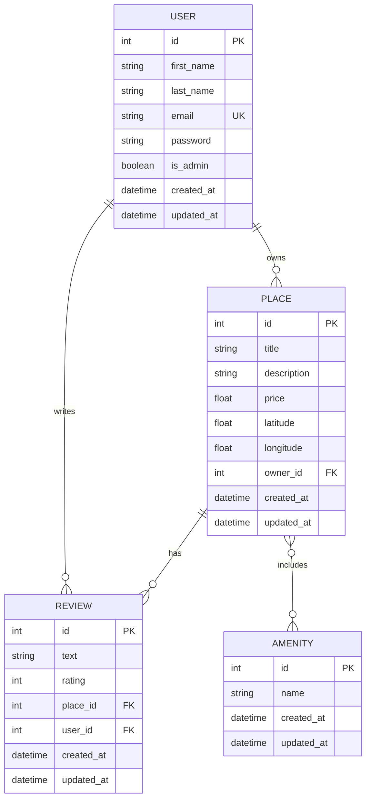

# HBnB Evolution - Part 3: Authentication & Database Integration

[English](#english) | [Français](#français)

---

## English

### 📋 Project Overview

**HBnB - Auth & DB** is Part 3 of the HBnB Evolution project, focusing on implementing authentication, authorization, and database integration for a simplified AirBnB-like application.

**Team:** Yassin Jaghmim, Guillaume Watelet  
**Level:** Novice  
**Weight:** 1

### 🎯 Project Objectives

This project extends the backend application by:

1. **Authentication & Authorization**: Implementing JWT-based authentication using Flask-JWT-Extended and role-based access control
2. **Database Integration**: Replacing in-memory storage with SQLite (development) and MySQL (production) using SQLAlchemy ORM
3. **CRUD Operations**: Refactoring all operations for database persistence
4. **Database Design**: Creating and visualizing database schemas using Mermaid.js
5. **Data Validation**: Ensuring proper validation and constraints in models

### 🎓 Learning Objectives

By completing this project, you will:

- Implement JWT authentication to secure API endpoints
- Enforce role-based access control (users vs. administrators)
- Transition from in-memory to database-backed persistence
- Design relational database schemas with proper relationships
- Build secure, scalable backend systems for production environments

### 🏗️ Architecture

```
┌─────────────────────────────────────────────┐
│           API Layer (Flask-RESTX)           │
│  - JWT Authentication & Authorization       │
│  - RESTful Endpoints                        │
└──────────────────┬──────────────────────────┘
                   │
┌──────────────────▼──────────────────────────┐
│         Business Logic Layer (Facade)       │
│  - Service orchestration                    │
│  - Business rules validation                │
└──────────────────┬──────────────────────────┘
                   │
┌──────────────────▼──────────────────────────┐
│       Persistence Layer (Repository)        │
│  - SQLAlchemy ORM                           │
│  - CRUD operations                          │
└──────────────────┬──────────────────────────┘
                   │
┌──────────────────▼──────────────────────────┐
│            Database Layer                   │
│  - SQLite (Development)                     │
│  - MySQL (Production)                       │
└─────────────────────────────────────────────┘
```

### 📊 Database Schema

#### Entities

- **User**: User accounts with authentication
- **Place**: Property listings
- **Review**: User reviews for places
- **Amenity**: Property amenities/features
- **Place_Amenity**: Many-to-many relationship table

#### Relationships

- User → Place: One-to-Many (owner relationship)
- User → Review: One-to-Many
- Place → Review: One-to-Many
- Place ↔ Amenity: Many-to-Many

### 🆕 New Features in Part 3

Part 3 represents a major evolution from Part 2, transitioning from an in-memory prototype to a production-ready application with authentication and persistent storage.

#### Major Additions from Part 2

**1. Authentication & Security**
- JWT-based authentication system
- Secure password hashing with bcrypt
- Token-based session management
- Role-based access control (RBAC)

**2. Database Persistence**
- SQLite for development environment
- MySQL support for production
- SQLAlchemy ORM integration
- Complete data persistence layer

**3. Enhanced User Management**
- User registration with secure passwords
- Login system with JWT tokens
- Admin privileges and role management
- User profile management

**4. Database Relationships**
- One-to-Many: User → Places, User → Reviews, Place → Reviews
- Many-to-Many: Place ↔ Amenities
- Foreign key constraints
- Referential integrity

### 📊 Database Schema Explanation

#### Understanding the ER Diagram

The Entity-Relationship (ER) diagram visualizes how data is organized and connected in the HBnB application.



#### Database Keys Explained

**Primary Keys (PK) - Clés Primaires**
- Unique identifier for each record in a table
- Auto-incremented integer
- Every table has an `id` field as PK
- Example: `USER.id = 1` uniquely identifies one user

**Foreign Keys (FK) - Clés Étrangères**
- Links records between tables
- References a Primary Key in another table
- Ensures referential integrity
- Examples:
  - `PLACE.owner_id` → references `USER.id`
  - `REVIEW.place_id` → references `PLACE.id`
  - `REVIEW.user_id` → references `USER.id`

**Unique Keys (UK) - Clés Uniques**
- Ensures no duplicate values in a column
- Can be NULL (unlike PK)
- Example: `USER.email` must be unique (no two users with same email)

#### Relationship Types

**One-to-Many (||--o{) - Un-à-Plusieurs**
- One record in Table A relates to many records in Table B
- Examples:
  - One User owns many Places
  - One User writes many Reviews
  - One Place has many Reviews

**Many-to-Many (}o--o{) - Plusieurs-à-Plusieurs**
- Many records in Table A relate to many records in Table B
- Requires an association table
- Example: Places ↔ Amenities (via `place_amenity_association` table)

### 🔧 Technologies Used

- **Python 3.x**: Core programming language
- **Flask**: Web framework
- **Flask-RESTX**: REST API framework
- **Flask-JWT-Extended**: JWT authentication
- **Flask-Bcrypt**: Password hashing
- **SQLAlchemy**: ORM for database operations
- **SQLite**: Development database
- **MySQL**: Production database
- **Mermaid.js**: Database diagram generation

### 🚀 Installation & Setup

```bash
# Clone the repository
git clone https://github.com/(Lagui117 or yassin-info)/holbertonschool-hbnb.git
cd holbertonschool-hbnb/part3

# Create virtual environment
python3 -m venv .venv
source .venv/bin/activate  # On Windows: .venv\Scripts\activate

# Install dependencies
pip install -r requirements.txt

# Initialize database
flask db init
flask db migrate
flask db upgrade

# Run the application
python3 run.py
```

### 🧪 Testing

```bash
# Run all tests
python3 run_tests.py

# Run specific test file
python3 -m unittest tests/test_user.py

# Run with coverage
coverage run -m unittest discover tests/
coverage report
```

### 📚 API Endpoints

#### Public Endpoints
- `GET /api/v1/places/` - List all places
- `GET /api/v1/places/<id>` - Get place details

#### Authentication
- `POST /api/v1/auth/register` - User registration
- `POST /api/v1/auth/login` - User login

#### Authenticated User Endpoints
- `POST /api/v1/places/` - Create place
- `PUT /api/v1/places/<id>` - Update own place
- `DELETE /api/v1/places/<id>` - Delete own place
- `POST /api/v1/reviews/` - Create review
- `PUT /api/v1/users/<id>` - Update own profile

#### Admin Endpoints
- `POST /api/v1/users/` - Create user
- `PUT /api/v1/users/<id>` - Update any user
- `POST /api/v1/amenities/` - Create amenity
- `PUT /api/v1/amenities/<id>` - Update amenity

### 🔐 Authentication Flow

1. User registers or logs in
2. Server generates JWT token
3. Client includes token in Authorization header: `Bearer <token>`
4. Server validates token for protected endpoints
5. Server checks user role for admin endpoints

### 📖 Resources

- [Flask Documentation](https://flask.palletsprojects.com/)
- [Flask-JWT-Extended](https://flask-jwt-extended.readthedocs.io/)
- [SQLAlchemy Documentation](https://docs.sqlalchemy.org/)
- [Flask-SQLAlchemy](https://flask-sqlalchemy.palletsprojects.com/)
- [Mermaid.js Documentation](https://mermaid.js.org/)

### 👥 Contributors

- **Yassin Jaghmim**
- **Guillaume Watelet**

### 📄 License

This project is part of the Holberton School curriculum.

---

## Français

### 📋 Aperçu du Projet

**HBnB - Auth & DB** est la partie 3 du projet HBnB Evolution, axée sur l'implémentation de l'authentification, de l'autorisation et de l'intégration de base de données pour une application simplifiée de type AirBnB.

**Équipe :** Yassin Jaghmim, Guillaume Watelet  
**Niveau :** Débutant  
**Poids :** 1

### 🎯 Objectifs du Projet

Ce projet étend l'application backend en :

1. **Authentification & Autorisation** : Implémentation de l'authentification basée sur JWT avec Flask-JWT-Extended et contrôle d'accès basé sur les rôles
2. **Intégration de Base de Données** : Remplacement du stockage en mémoire par SQLite (développement) et MySQL (production) utilisant l'ORM SQLAlchemy
3. **Opérations CRUD** : Refactorisation de toutes les opérations pour la persistance en base de données
4. **Conception de Base de Données** : Création et visualisation des schémas de base de données avec Mermaid.js
5. **Validation des Données** : Assurance d'une validation et de contraintes appropriées dans les modèles

### 🎓 Objectifs d'Apprentissage

En complétant ce projet, vous allez :

- Implémenter l'authentification JWT pour sécuriser les endpoints API
- Appliquer le contrôle d'accès basé sur les rôles (utilisateurs vs. administrateurs)
- Passer du stockage en mémoire à la persistance en base de données
- Concevoir des schémas de base de données relationnelles avec les relations appropriées
- Construire des systèmes backend sécurisés et évolutifs pour les environnements de production

### 🏗️ Architecture

```
┌─────────────────────────────────────────────┐
│       Couche API (Flask-RESTX)              │
│  - Authentification & Autorisation JWT      │
│  - Endpoints RESTful                        │
└──────────────────┬──────────────────────────┘
                   │
┌──────────────────▼──────────────────────────┐
│    Couche Logique Métier (Facade)           │
│  - Orchestration des services               │
│  - Validation des règles métier             │
└──────────────────┬──────────────────────────┘
                   │
┌──────────────────▼──────────────────────────┐
│    Couche Persistance (Repository)          │
│  - ORM SQLAlchemy                           │
│  - Opérations CRUD                          │
└──────────────────┬──────────────────────────┘
                   │
┌──────────────────▼──────────────────────────┐
│         Couche Base de Données              │
│  - SQLite (Développement)                   │
│  - MySQL (Production)                       │
└─────────────────────────────────────────────┘
```

### 📊 Schéma de Base de Données

#### Entités

- **User** : Comptes utilisateurs avec authentification
- **Place** : Annonces de propriétés
- **Review** : Avis des utilisateurs sur les propriétés
- **Amenity** : Équipements/caractéristiques des propriétés
- **Place_Amenity** : Table de relation plusieurs-à-plusieurs

#### Relations

- User → Place : Un-à-Plusieurs (relation propriétaire)
- User → Review : Un-à-Plusieurs
- Place → Review : Un-à-Plusieurs
- Place ↔ Amenity : Plusieurs-à-Plusieurs

### 📝 Aperçu des Tâches

#### Tâche 0 : Configuration de l'Application Factory
Mise à jour de la Flask Application Factory pour gérer différentes configurations (développement, test, production).

#### Tâche 1 : Modèle User avec Hachage de Mot de Passe
Amélioration du modèle User avec stockage sécurisé des mots de passe utilisant bcrypt :
- Hachage des mots de passe avant stockage
- Implémentation de la vérification des mots de passe
- Exclusion des mots de passe des réponses GET

#### Tâche 2 : Authentification JWT
Implémentation de l'authentification basée sur JWT :
- Endpoint de connexion utilisateur
- Génération et vérification des tokens JWT
- Endpoints protégés nécessitant une authentification

#### Tâche 3 : Accès Utilisateur Authentifié
Sécurisation des endpoints pour les utilisateurs authentifiés :
- Créer/modifier/supprimer ses propres places
- Créer/modifier ses propres avis
- Mettre à jour ses propres détails utilisateur
- Validation de propriété

#### Tâche 4 : Accès Administrateur
Implémentation du contrôle d'accès basé sur les rôles pour les administrateurs :
- Créer et gérer n'importe quel utilisateur
- Modifier les détails de n'importe quel utilisateur
- Gérer les équipements
- Contourner les restrictions de propriété

#### Tâche 5 : Repository SQLAlchemy
Remplacement du stockage en mémoire par SQLAlchemy :
- Création du SQLAlchemyRepository
- Implémentation des opérations CRUD
- Maintien de l'interface du pattern repository

#### Tâche 6 : Mapping de l'Entité User
Mapping de l'entité User vers un modèle SQLAlchemy :
- Définition du schéma de base de données
- Implémentation du UserRepository
- Mise à jour de la couche Facade

#### Tâche 7 : Mapping des Entités (Place, Review, Amenity)
Mapping des entités restantes vers la base de données :
- Modèle Place avec attributs
- Modèle Review avec attributs
- Modèle Amenity avec attributs
- Implémentation des repositories respectifs

#### Tâche 8 : Relations entre Entités
Définition des relations entre entités :
- Relations Un-à-Plusieurs
- Relations Plusieurs-à-Plusieurs
- Contraintes de clés étrangères
- Navigation bidirectionnelle

#### Tâche 9 : Scripts SQL
Création de scripts SQL pour :
- Génération du schéma de base de données
- Population des données initiales
- Création de l'utilisateur administrateur
- Initialisation des équipements

#### Tâche 10 : Diagrammes de Base de Données
Génération de diagrammes ER avec Mermaid.js :
- Représentation visuelle du schéma
- Relations entre entités
- Intégration dans la documentation

### 🔧 Technologies Utilisées

- **Python 3.x** : Langage de programmation principal
- **Flask** : Framework web
- **Flask-RESTX** : Framework API REST
- **Flask-JWT-Extended** : Authentification JWT
- **Flask-Bcrypt** : Hachage des mots de passe
- **SQLAlchemy** : ORM pour les opérations de base de données
- **SQLite** : Base de données de développement
- **MySQL** : Base de données de production
- **Mermaid.js** : Génération de diagrammes de base de données

### 🚀 Installation & Configuration

```bash
# Cloner le dépôt
git clone https://github.com/yourusername/holbertonschool-hbnb.git
cd holbertonschool-hbnb/part3

# Créer l'environnement virtuel
python3 -m venv .venv
source .venv/bin/activate  # Sur Windows: .venv\Scripts\activate

# Installer les dépendances
pip install -r requirements.txt

# Initialiser la base de données
flask db init
flask db migrate
flask db upgrade

# Lancer l'application
python3 run.py
```

### 🧪 Tests

```bash
# Exécuter tous les tests
python3 run_tests.py

# Exécuter un fichier de test spécifique
python3 -m unittest tests/test_user.py

# Exécuter avec couverture
coverage run -m unittest discover tests/
coverage report
```

### 📚 Endpoints API

#### Endpoints Publics
- `GET /api/v1/places/` - Liste toutes les places
- `GET /api/v1/places/<id>` - Obtenir les détails d'une place

#### Authentification
- `POST /api/v1/auth/register` - Inscription utilisateur
- `POST /api/v1/auth/login` - Connexion utilisateur

#### Endpoints Utilisateur Authentifié
- `POST /api/v1/places/` - Créer une place
- `PUT /api/v1/places/<id>` - Modifier sa propre place
- `DELETE /api/v1/places/<id>` - Supprimer sa propre place
- `POST /api/v1/reviews/` - Créer un avis
- `PUT /api/v1/users/<id>` - Mettre à jour son propre profil

#### Endpoints Admin
- `POST /api/v1/users/` - Créer un utilisateur
- `PUT /api/v1/users/<id>` - Modifier n'importe quel utilisateur
- `POST /api/v1/amenities/` - Créer un équipement
- `PUT /api/v1/amenities/<id>` - Modifier un équipement

### 🔐 Flux d'Authentification

1. L'utilisateur s'inscrit ou se connecte
2. Le serveur génère un token JWT
3. Le client inclut le token dans l'en-tête Authorization : `Bearer <token>`
4. Le serveur valide le token pour les endpoints protégés
5. Le serveur vérifie le rôle utilisateur pour les endpoints admin

### 📖 Ressources

- [Documentation Flask](https://flask.palletsprojects.com/)
- [Flask-JWT-Extended](https://flask-jwt-extended.readthedocs.io/)
- [Documentation SQLAlchemy](https://docs.sqlalchemy.org/)
- [Flask-SQLAlchemy](https://flask-sqlalchemy.palletsprojects.com/)
- [Documentation Mermaid.js](https://mermaid.js.org/)

### ✅ Statut des Tâches

| Task | Description | Statut |
|------|-------------|--------|
| 0 | Application Factory avec Configuration | ✅ Complété |
| 1 | Hachage de Mot de Passe (User Model) | ✅ Complété |
| 2 | Authentification JWT | ✅ Complété |
| 3 | Endpoints Utilisateurs Authentifiés | ✅ Complété |
| 4 | Endpoints Administrateur | ✅ Complété |
| 5 | SQLAlchemy Repository | ✅ Complété |
| 6 | Mapping Entité User | ✅ Complété |
| 7 | Mapping Entités Place, Review, Amenity | ✅ Complété |
| 8 | Relations SQLAlchemy | ✅ Complété |
| 9 | Scripts SQL | ✅ Complété |
| 10 | Diagrammes ER | ✅ Complété |

### 📝 Fichiers Importants

- `API_TESTING.md` - Guide complet de test de l'API avec exemples curl
- `ER_diag.md` - Diagramme Entity-Relationship avec Mermaid.js
- `setup.sql` - Script SQL pour création manuelle de la base
- `create_first_admin.py` - Script d'initialisation du premier admin

### 👥 Contributeurs

- **Yassin Jaghmim**
- **Guillaume Watelet**