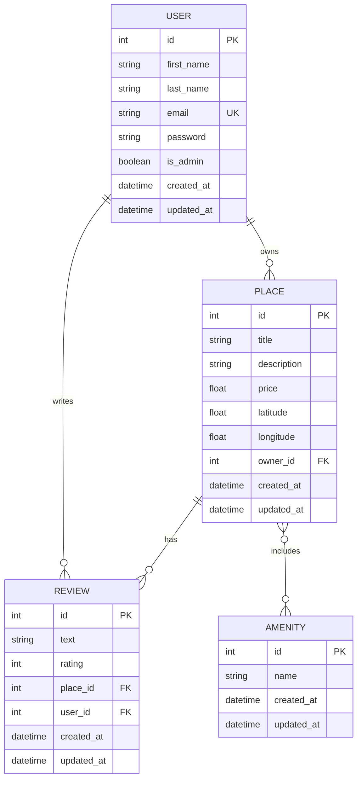

 HBnB Evolution - Part : Authentication & Database Integration

[English](english) | [Français](français)

---

 English

  Project Overview

HBnB - Auth & DB is Part  of the HBnB Evolution project, focusing on implementing authentication, authorization, and database integration for a simplified AirBnB-like application.

Team: Yassin Jaghmim, Guillaume Watelet  
Level: Novice  
Weight: 

  Project Objectives

This project extends the backend application by:

. Authentication & Authorization: Implementing JWT-based authentication using Flask-JWT-Extended and role-based access control
. Database Integration: Replacing in-memory storage with SQLite (development) and MySQL (production) using SQLAlchemy ORM
. CRUD Operations: Refactoring all operations for database persistence
. Database Design: Creating and visualizing database schemas using Mermaid.js
. Data Validation: Ensuring proper validation and constraints in models

  Learning Objectives

By completing this project, you will:

- Implement JWT authentication to secure API endpoints
- Enforce role-based access control (users vs. administrators)
- Transition from in-memory to database-backed persistence
- Design relational database schemas with proper relationships
- Build secure, scalable backend systems for production environments

  Architecture

```

           API Layer (Flask-RESTX)           
  - JWT Authentication & Authorization       
  - RESTful Endpoints                        

                   

         Business Logic Layer (Facade)       
  - Service orchestration                    
  - Business rules validation                

                   

       Persistence Layer (Repository)        
  - SQLAlchemy ORM                           
  - CRUD operations                          

                   

            Database Layer                   
  - SQLite (Development)                     
  - MySQL (Production)                       

```

  Database Schema

 Entities

- User: User accounts with authentication
- Place: Property listings
- Review: User reviews for places
- Amenity: Property amenities/features
- Place_Amenity: Many-to-many relationship table

 Relationships

- User  Place: One-to-Many (owner relationship)
- User  Review: One-to-Many
- Place  Review: One-to-Many
- Place  Amenity: Many-to-Many

  New Features in Part 

Part  represents a major evolution from Part , transitioning from an in-memory prototype to a production-ready application with authentication and persistent storage.

 Major Additions from Part 

. Authentication & Security
- JWT-based authentication system
- Secure password hashing with bcrypt
- Token-based session management
- Role-based access control (RBAC)

. Database Persistence
- SQLite for development environment
- MySQL support for production
- SQLAlchemy ORM integration
- Complete data persistence layer

. Enhanced User Management
- User registration with secure passwords
- Login system with JWT tokens
- Admin privileges and role management
- User profile management

. Database Relationships
- One-to-Many: User  Places, User  Reviews, Place  Reviews
- Many-to-Many: Place  Amenities
- Foreign key constraints
- Referential integrity

  Database Schema Explanation

 Understanding the ER Diagram

The Entity-Relationship (ER) diagram visualizes how data is organized and connected in the HBnB application.



 Database Keys Explained

Primary Keys (PK) - Cls Primaires
- Unique identifier for each record in a table
- Auto-incremented integer
- Every table has an `id` field as PK
- Example: `USER.id = ` uniquely identifies one user

Foreign Keys (FK) - Cls Étrangères
- Links records between tables
- References a Primary Key in another table
- Ensures referential integrity
- Examples:
  - `PLACE.owner_id`  references `USER.id`
  - `REVIEW.place_id`  references `PLACE.id`
  - `REVIEW.user_id`  references `USER.id`

Unique Keys (UK) - Cls Uniques
- Ensures no duplicate values in a column
- Can be NULL (unlike PK)
- Example: `USER.email` must be unique (no two users with same email)

 Relationship Types

One-to-Many (||--o{) - Un-à-Plusieurs
- One record in Table A relates to many records in Table B
- Examples:
  - One User owns many Places
  - One User writes many Reviews
  - One Place has many Reviews

Many-to-Many (}o--o{) - Plusieurs-à-Plusieurs
- Many records in Table A relate to many records in Table B
- Requires an association table
- Example: Places  Amenities (via `place_amenity_association` table)

  Technologies Used

- Python .x: Core programming language
- Flask: Web framework
- Flask-RESTX: REST API framework
- Flask-JWT-Extended: JWT authentication
- Flask-Bcrypt: Password hashing
- SQLAlchemy: ORM for database operations
- SQLite: Development database
- MySQL: Production database
- Mermaid.js: Database diagram generation

  Installation & Setup

```bash
 Clone the repository
git clone https://github.com/(Lagui or yassin-info)/holbertonschool-hbnb.git
cd holbertonschool-hbnb/part

 Create virtual environment
python -m venv .venv
source .venv/bin/activate   On Windows: .venv\Scripts\activate

 Install dependencies
pip install -r requirements.txt

 Initialize database
flask db init
flask db migrate
flask db upgrade

 Run the application
python run.py
```

  Testing

```bash
 Run all tests
python run_tests.py

 Run specific test file
python -m unittest tests/test_user.py

 Run with coverage
coverage run -m unittest discover tests/
coverage report
```

  API Endpoints

 Public Endpoints
- `GET /api/v/places/` - List all places
- `GET /api/v/places/<id>` - Get place details

 Authentication
- `POST /api/v/auth/register` - User registration
- `POST /api/v/auth/login` - User login

 Authenticated User Endpoints
- `POST /api/v/places/` - Create place
- `PUT /api/v/places/<id>` - Update own place
- `DELETE /api/v/places/<id>` - Delete own place
- `POST /api/v/reviews/` - Create review
- `PUT /api/v/users/<id>` - Update own profile

 Admin Endpoints
- `POST /api/v/users/` - Create user
- `PUT /api/v/users/<id>` - Update any user
- `POST /api/v/amenities/` - Create amenity
- `PUT /api/v/amenities/<id>` - Update amenity

  Authentication Flow

. User registers or logs in
. Server generates JWT token
. Client includes token in Authorization header: `Bearer <token>`
. Server validates token for protected endpoints
. Server checks user role for admin endpoints

  Resources

- [Flask Documentation](https://flask.palletsprojects.com/)
- [Flask-JWT-Extended](https://flask-jwt-extended.readthedocs.io/)
- [SQLAlchemy Documentation](https://docs.sqlalchemy.org/)
- [Flask-SQLAlchemy](https://flask-sqlalchemy.palletsprojects.com/)
- [Mermaid.js Documentation](https://mermaid.js.org/)

  Contributors

- Yassin Jaghmim
- Guillaume Watelet

  License

This project is part of the Holberton School curriculum.

---

 Français

  Aperçu du Projet

HBnB - Auth & DB est la partie  du projet HBnB Evolution, axe sur l'implmentation de l'authentification, de l'autorisation et de l'intgration de base de donnes pour une application simplifie de type AirBnB.

Équipe : Yassin Jaghmim, Guillaume Watelet  
Niveau : Dbutant  
Poids : 

  Objectifs du Projet

Ce projet tend l'application backend en :

. Authentification & Autorisation : Implmentation de l'authentification base sur JWT avec Flask-JWT-Extended et contrôle d'accès bas sur les rôles
. Intgration de Base de Donnes : Remplacement du stockage en mmoire par SQLite (dveloppement) et MySQL (production) utilisant l'ORM SQLAlchemy
. Oprations CRUD : Refactorisation de toutes les oprations pour la persistance en base de donnes
. Conception de Base de Donnes : Cration et visualisation des schmas de base de donnes avec Mermaid.js
. Validation des Donnes : Assurance d'une validation et de contraintes appropries dans les modèles

  Objectifs d'Apprentissage

En compltant ce projet, vous allez :

- Implmenter l'authentification JWT pour scuriser les endpoints API
- Appliquer le contrôle d'accès bas sur les rôles (utilisateurs vs. administrateurs)
- Passer du stockage en mmoire à la persistance en base de donnes
- Concevoir des schmas de base de donnes relationnelles avec les relations appropries
- Construire des systèmes backend scuriss et volutifs pour les environnements de production

  Architecture

```

       Couche API (Flask-RESTX)              
  - Authentification & Autorisation JWT      
  - Endpoints RESTful                        

                   

    Couche Logique Mtier (Facade)           
  - Orchestration des services               
  - Validation des règles mtier             

                   

    Couche Persistance (Repository)          
  - ORM SQLAlchemy                           
  - Oprations CRUD                          

                   

         Couche Base de Donnes              
  - SQLite (Dveloppement)                   
  - MySQL (Production)                       

```

  Schma de Base de Donnes

 Entits

- User : Comptes utilisateurs avec authentification
- Place : Annonces de proprits
- Review : Avis des utilisateurs sur les proprits
- Amenity : Équipements/caractristiques des proprits
- Place_Amenity : Table de relation plusieurs-à-plusieurs

 Relations

- User  Place : Un-à-Plusieurs (relation propritaire)
- User  Review : Un-à-Plusieurs
- Place  Review : Un-à-Plusieurs
- Place  Amenity : Plusieurs-à-Plusieurs

  Aperçu des Tâches

 Tâche  : Configuration de l'Application Factory
Mise à jour de la Flask Application Factory pour grer diffrentes configurations (dveloppement, test, production).

 Tâche  : Modèle User avec Hachage de Mot de Passe
Amlioration du modèle User avec stockage scuris des mots de passe utilisant bcrypt :
- Hachage des mots de passe avant stockage
- Implmentation de la vrification des mots de passe
- Exclusion des mots de passe des rponses GET

 Tâche  : Authentification JWT
Implmentation de l'authentification base sur JWT :
- Endpoint de connexion utilisateur
- Gnration et vrification des tokens JWT
- Endpoints protgs ncessitant une authentification

 Tâche  : Accès Utilisateur Authentifi
Scurisation des endpoints pour les utilisateurs authentifis :
- Crer/modifier/supprimer ses propres places
- Crer/modifier ses propres avis
- Mettre à jour ses propres dtails utilisateur
- Validation de proprit

 Tâche  : Accès Administrateur
Implmentation du contrôle d'accès bas sur les rôles pour les administrateurs :
- Crer et grer n'importe quel utilisateur
- Modifier les dtails de n'importe quel utilisateur
- Grer les quipements
- Contourner les restrictions de proprit

 Tâche  : Repository SQLAlchemy
Remplacement du stockage en mmoire par SQLAlchemy :
- Cration du SQLAlchemyRepository
- Implmentation des oprations CRUD
- Maintien de l'interface du pattern repository

 Tâche  : Mapping de l'Entit User
Mapping de l'entit User vers un modèle SQLAlchemy :
- Dfinition du schma de base de donnes
- Implmentation du UserRepository
- Mise à jour de la couche Facade

 Tâche  : Mapping des Entits (Place, Review, Amenity)
Mapping des entits restantes vers la base de donnes :
- Modèle Place avec attributs
- Modèle Review avec attributs
- Modèle Amenity avec attributs
- Implmentation des repositories respectifs

 Tâche  : Relations entre Entits
Dfinition des relations entre entits :
- Relations Un-à-Plusieurs
- Relations Plusieurs-à-Plusieurs
- Contraintes de cls trangères
- Navigation bidirectionnelle

 Tâche  : Scripts SQL
Cration de scripts SQL pour :
- Gnration du schma de base de donnes
- Population des donnes initiales
- Cration de l'utilisateur administrateur
- Initialisation des quipements

 Tâche  : Diagrammes de Base de Donnes
Gnration de diagrammes ER avec Mermaid.js :
- Reprsentation visuelle du schma
- Relations entre entits
- Intgration dans la documentation

  Technologies Utilises

- Python .x : Langage de programmation principal
- Flask : Framework web
- Flask-RESTX : Framework API REST
- Flask-JWT-Extended : Authentification JWT
- Flask-Bcrypt : Hachage des mots de passe
- SQLAlchemy : ORM pour les oprations de base de donnes
- SQLite : Base de donnes de dveloppement
- MySQL : Base de donnes de production
- Mermaid.js : Gnration de diagrammes de base de donnes

  Installation & Configuration

```bash
 Cloner le dpôt
git clone https://github.com/yourusername/holbertonschool-hbnb.git
cd holbertonschool-hbnb/part

 Crer l'environnement virtuel
python -m venv .venv
source .venv/bin/activate   Sur Windows: .venv\Scripts\activate

 Installer les dpendances
pip install -r requirements.txt

 Initialiser la base de donnes
flask db init
flask db migrate
flask db upgrade

 Lancer l'application
python run.py
```

  Tests

```bash
 Excuter tous les tests
python run_tests.py

 Excuter un fichier de test spcifique
python -m unittest tests/test_user.py

 Excuter avec couverture
coverage run -m unittest discover tests/
coverage report
```

  Endpoints API

 Endpoints Publics
- `GET /api/v/places/` - Liste toutes les places
- `GET /api/v/places/<id>` - Obtenir les dtails d'une place

 Authentification
- `POST /api/v/auth/register` - Inscription utilisateur
- `POST /api/v/auth/login` - Connexion utilisateur

 Endpoints Utilisateur Authentifi
- `POST /api/v/places/` - Crer une place
- `PUT /api/v/places/<id>` - Modifier sa propre place
- `DELETE /api/v/places/<id>` - Supprimer sa propre place
- `POST /api/v/reviews/` - Crer un avis
- `PUT /api/v/users/<id>` - Mettre à jour son propre profil

 Endpoints Admin
- `POST /api/v/users/` - Crer un utilisateur
- `PUT /api/v/users/<id>` - Modifier n'importe quel utilisateur
- `POST /api/v/amenities/` - Crer un quipement
- `PUT /api/v/amenities/<id>` - Modifier un quipement

  Flux d'Authentification

. L'utilisateur s'inscrit ou se connecte
. Le serveur gnère un token JWT
. Le client inclut le token dans l'en-tête Authorization : `Bearer <token>`
. Le serveur valide le token pour les endpoints protgs
. Le serveur vrifie le rôle utilisateur pour les endpoints admin

  Ressources

- [Documentation Flask](https://flask.palletsprojects.com/)
- [Flask-JWT-Extended](https://flask-jwt-extended.readthedocs.io/)
- [Documentation SQLAlchemy](https://docs.sqlalchemy.org/)
- [Flask-SQLAlchemy](https://flask-sqlalchemy.palletsprojects.com/)
- [Documentation Mermaid.js](https://mermaid.js.org/)

  Statut des Tâches

| Task | Description | Statut |
|------|-------------|--------|
|  | Application Factory avec Configuration |  Complt |
|  | Hachage de Mot de Passe (User Model) |  Complt |
|  | Authentification JWT |  Complt |
|  | Endpoints Utilisateurs Authentifis |  Complt |
|  | Endpoints Administrateur |  Complt |
|  | SQLAlchemy Repository |  Complt |
|  | Mapping Entit User |  Complt |
|  | Mapping Entits Place, Review, Amenity |  Complt |
|  | Relations SQLAlchemy |  Complt |
|  | Scripts SQL |  Complt |
|  | Diagrammes ER |  Complt |

  Fichiers Importants

- `API_TESTING.md` - Guide complet de test de l'API avec exemples curl
- `ER_diag.md` - Diagramme Entity-Relationship avec Mermaid.js
- `setup.sql` - Script SQL pour cration manuelle de la base
- `create_first_admin.py` - Script d'initialisation du premier admin

  Contributeurs

- Yassin Jaghmim
- Guillaume Watelet